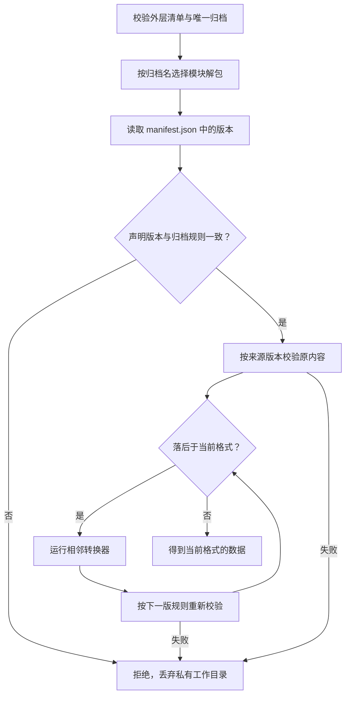
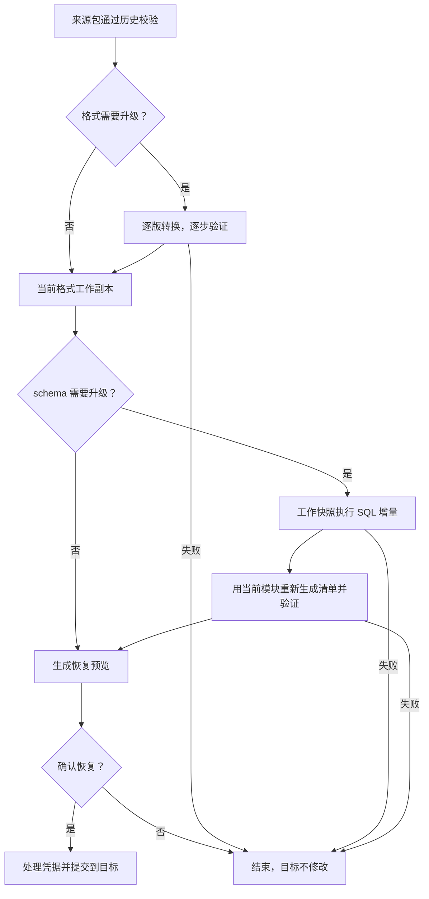

# 备份格式迁移：追加版本，不改调度器

本文写给要更新备份格式的开发者。当前导出格式仍为 **2**，数据库 schema 仍为 **1**。格式 3 只在测试中模拟，不是已发布格式。

## 两条链放在同一个迁移目录

| 文件                              | 负责什么                                       | 注册位置             |
| --------------------------------- | ---------------------------------------------- | -------------------- |
| `migrations/001-initial.ts`       | SQLite 与 PostgreSQL 的 schema 1 SQL           | `migrations.ts`      |
| `migrations/backup/001.ts`        | 备份格式 1 的清单、gzip 归档、读取与校验规则   | `backup-format.ts`   |
| `migrations/backup/002.ts`        | 格式 2 的定义，以及清单 1 → 2 转换             | `backup-format.ts`   |
| `migrations/backup/payload-v1.ts` | 冻结的报告算法 1：行排序、摘要、媒体及序号检查 | 格式 1、2 模块引用   |
| 未来 `migrations/002-*.ts`        | 表结构增量 SQL，分别提供两种数据库版本         | 追加 SQL 注册项      |
| 未来 `migrations/backup/003.ts`   | 格式 3 的完整定义与 2 → 3 转换器               | 追加格式和迁移注册项 |

两条链分别连续编号。schema 2 不要求备份格式也变成 2；压缩方式改变也不自动改变数据库版本。已经发布的定义和摘要算法保持原样，未来增加新定义。

## 一个备份版本模块需要提供什么

[BackupFormat 接口](../../apps/server/src/migrations/backup/shared.ts) 是版本模块与公共调度器的约定。

| 方法或字段         | 模块应完成的工作                                                     |
| ------------------ | -------------------------------------------------------------------- |
| `version`、`parse` | 声明编号，严格解析本版清单                                           |
| `archive.name`     | 本版外层数据归档文件名                                               |
| `archive.extract`  | 在私有目录安全解包，拒绝链接、路径穿越和重复条目                     |
| `archive.pack`     | 按本版规则打包，支持文件输出和流输出                                 |
| `paths`            | 告诉后续恢复器，工作目录中的 SQLite 快照和媒体在哪里                 |
| `verify`           | 用本版规则验证数据库、媒体和摘要，返回恢复预览的统计报告             |
| `create`           | 根据快照和来源信息生成本版清单；需要改变文件表达时，也在版本模块处理 |

接口中的这些方法为可选，是为了允许只测试清单转换的轻量测试定义。**实际归档操作会要求它们全部存在**，缺一项就报错。格式 1、2 的 `integrity` 是历史便利方法，公共调度器不依赖它；未来算法不必使用相同的字段名或 SHA-256。

稳定入口是外层 `deployment.env`、`SHA256SUMS` 和解包后的 `manifest.json`。清单必须保留 `version` 及来源字段，调度器才有办法选择版本模块。内部数据路径和压缩实现由版本模块负责。若文件编码改变，使用新的归档名；同一个归档名必须使用同一个解包器，不能让入口猜测编码。

## 导入入口怎样选择版本

[backup-package.ts](../../apps/server/src/backup-package.ts) 不判断“如果版本是 1 就如何处理”，也不引用格式 2 的字段 Schema。它根据注册表调用版本模块。

旧归档只由自己的版本模块读取。当前软件普通恢复面对的是已经转换好的当前格式。gzip 是格式 1 的读取定义，不是普通 Zstandard 解包器的兼容分支。

格式发生升级时，调度器用最新模块重新打包临时归档，再用最新模块解包并校验。已经是当前格式时，不做重复压缩。源归档和源部署配置始终保留原字节。

## 格式转换与 SQL 升级的边界

转换器接收已经验证的清单和私有目录，只负责相邻格式。例如 2 → 3 不应直接替代 1 → 2，也不能替代数据库 SQL。

格式转换不能改 `format`、`applicationVersion`、`schemaVersion`、`provider`、`createdAt`。这些是来源事实。SQL 升级完成后，工作副本才重新生成与升级后内容一致的清单和摘要；恢复预览仍保留原始版本用于展示。

软件、格式或 schema 高于当前软件支持范围的备份会被拒绝。注册表缺号、输出版本不对、来源信息被改写、任何中间结果校验失败，都会停止处理。

## 添加格式 3 的实际步骤

1. 新建 `migrations/backup/003.ts`，实现上表中的完整版本模块。
2. 在该文件声明 `{from:2,to:3,name,migrate}`，严格按格式 2 定义读取输入，只输出格式 3。
3. 在 `backup-format.ts` 末尾追加模块和转换器。最新格式与归档名从注册表取得，不手工改公共导入、导出、管理程序或恢复调度器。
4. 如果改变校验算法，新增并冻结相应算法实现；旧模块继续引用旧算法。如果改变内部路径，模块提供新的 `paths` 与归档实现。媒体业务本身变化时，需要对应的数据与业务适配代码。
5. 更新软件版本、测试和文档。若同时改表，另追加 SQL 迁移。

SQL 迁移执行器同样只需追加与注册增量。业务表的备份从当前快照表集合读取，新自增表的序号从实际 SQLite schema 与序号记录发现；PostgreSQL 恢复按外键依赖排列表。已有用户头像循环仍通过先置空、再补引用处理。新增不同的循环外键属于数据依赖设计，需要明确的适配器，不能要求通用执行器猜测。

## 怎样证明没有写死版本

[backup-package.test.ts](../../apps/server/test/backup-package.test.ts) 追加了一个测试用格式 3：新的清单字段、新归档名、新工作快照路径、新生成与校验方法。它不修改公共调度器，完整导入格式 1、2、3，再执行测试 SQL 增量并生成 schema 2 的工作清单。这个测试只证明扩展机制，不发布格式 3 或 schema 2。

还需保留：来源文件不变、逐步验证、缺号和错误输出拒绝、gzip 与声明版本不符拒绝、空媒体目录、损坏与截断归档、真实 PostgreSQL 恢复和独立二进制导入测试。

## 手工接纳此前的 PostgreSQL 数据库

此前的数据库用 `database_meta=9`，新版本要求 `schema_migrations`。应用不会自动猜测并接纳没有历史的数据库。

[独立 SQL 文件](../../scripts/manual/postgresql-legacy-v9-to-schema1.sql) 是一次性工具，不是应用兼容分支。停止应用，在正确数据库中执行完整脚本。它检查旧标记、30 个表的字段、类型与非空约束，符合条件才登记 schema 1 并移除旧标记。业务数据保留；失败回滚；重复执行不会重复登记。不是旧标记 9 时不能强行套用此脚本。
