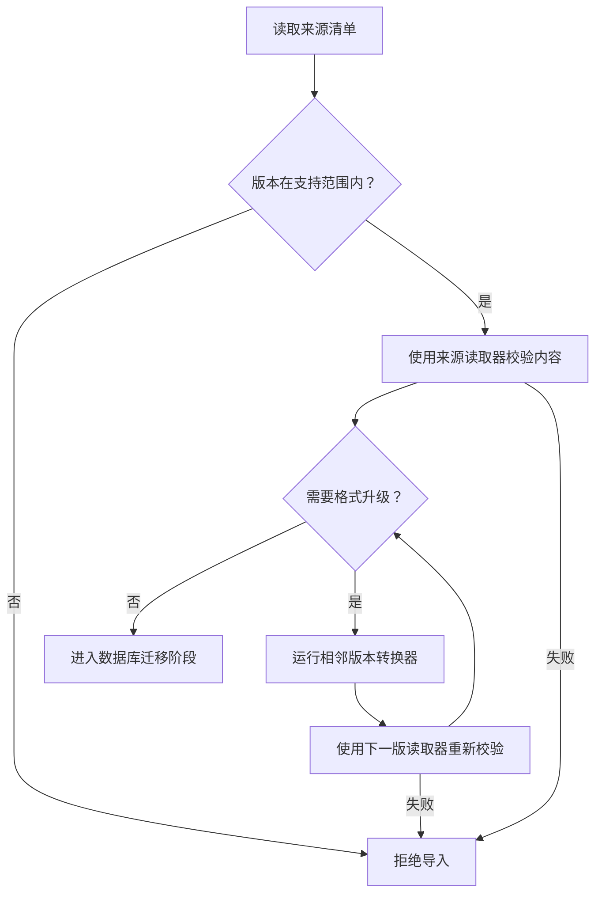
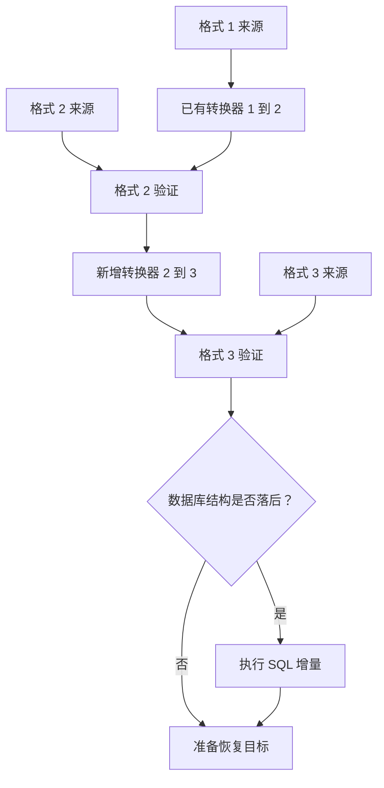

# 备份格式迁移

本文面向要修改备份清单、数据表达或摘要算法的开发者。表字段变化走[数据库迁移](migrations.md)；备份文件变化走这里。用户恢复时只看到预览和结果，不需要手工执行转换脚本。

## 当前机制

[backup-format.ts](../../apps/server/src/backup-format.ts) 注册格式读取器和相邻版本转换器。当前读取器为 1、2，转换器为 1 → 2，导出一律生成格式 2。

每个读取器负责严格解析自己的 JSON，并返回该格式的完整性校验信息。转换器接收已验证的清单和私有工作目录，可以转换清单或目录内的数据表达，返回下一版清单。框架按版本调用，不允许跳号或缺少步骤。

## 一次格式升级的约束

- 已发布的读取器和转换器保持原定义；修复通过新版本处理，不能把历史文件的含义改掉。
- 转换前验证来源内容。不能先改版本号，再用新规则给原文件重新算摘要而跳过旧规则。
- 格式转换不得修改 format、applicationVersion、schemaVersion、provider、createdAt。数据库结构另走 SQL 链，备份来源信息不能被伪造为目标版本。
- 转换器只操作传入的私有目录，不能访问目标数据库、部署配置或源归档。
- 每一步完成后解析下一版清单、核对数据库与媒体。中途失败立即停止，调用方丢弃整个工作目录。
- 全部成功后才保存转换后的清单。当前清单转换通过临时文件和 rename 替换，避免写到一半留下半份 JSON。

格式链不在目标数据库里创建历史表。源清单的 version 表明起点，注册表决定步骤，临时副本保存转换结果。SQL 链则在 schema_migrations 中保存执行历史和校验和，两者不能混用。

## 为什么格式 2 增加 integrity

格式 1 把 databaseSha256 和 report 放在顶层，隐含使用 SHA-256 和报告版本 1。格式 2 显式记录 algorithm 和 reportVersion。以后摘要规则变化可以明确选择历史读取规则，避免“字段名没变但算法变了”的隐式破坏。

当前 1 → 2 的清单转换只移动字段，原数据库与媒体字节不变。两版都使用报告算法 1。格式 2 的新导出改用 Zstandard 级别 15；gzip 只存在于格式 1 的增量转换器内。转换器在私有目录解包、校验、转换清单并重打包为格式 2 的 Zstandard 临时归档，之后普通恢复器只读取当前格式。来源归档不修改。

## 如何添加格式 3

这里的 3 是未来开发步骤，当前软件不接受格式 3：

1. 新建 `migrations/backup/003.ts`，声明格式 3 的严格字段 Schema 和读取器。
2. 在同一模块声明 `{from:2,to:3,name,migrate}`。从格式 2 的定义解析输入，只输出格式 3，不直接执行 1 → 3。
3. 在 backupFormats 末尾追加读取器，在 backupFormatMigrations 末尾追加转换器。注册检查要求从 1 开始连续，格式数比转换器数多 1。
4. 更新当前导出器和当前清单类型，使新导出与最新读取器一致。不能只让 BACKUP_FORMAT_VERSION 增加而沿用旧字段。
5. 如果变化涉及文件编码、内部路径或报告算法，同时补全解包白名单、历史数据读取和按 reportVersion 选择的校验逻辑。当前共同外壳固定为 love.sqlite、manifest.json、media/。
6. 增加应用版本，更新发布元数据和文档。新增格式本身不增加 SQL schema 编号。

## 测试要求

格式读取器单元测试不足以证明整个恢复可用。至少覆盖：

| 场景                         | 应证明的结果                       |
| ---------------------------- | ---------------------------------- |
| 格式 1 → 最新格式            | 旧字段与所有媒体可读，来源信息保留 |
| 跨多版链                     | 每步依次执行，每个中间结果重新验证 |
| 已是当前格式                 | 不重复转换，验证结果相同           |
| 来源损坏                     | 转换器未运行，目标不变             |
| 转换器失败或输出损坏         | 后续步骤停止，目标不变             |
| 缺号、错误版本、篡改来源字段 | 明确拒绝                           |
| 格式与 schema 同时落后       | 先转换格式，再迁移 SQL，最后恢复   |
| SQLite 与真实 PostgreSQL     | 用户、附件、媒体字节、自增序号完整 |
| 原备份保护                   | 恢复前后源归档及源清单字节完全一致 |

现有测试见 [backup-format.test.ts](../../apps/server/test/backup-format.test.ts) 和 [database-restore.test.ts](../../apps/server/test/database-restore.test.ts)。CI 使用真实 PostgreSQL，并验证编译后的管理程序，防止只在源码运行时可用。

## 增量文件与 SQL 放在哪里

两类迁移一起保存在 `apps/server/src/migrations/` 下。编号各自连续，不能把备份版本当成数据库版本。

| 文件                            | 负责什么                                   | 注册位置           |
| ------------------------------- | ------------------------------------------ | ------------------ |
| `migrations/001-initial.ts`     | SQLite、PostgreSQL 的 schema 1 SQL         | `migrations.ts`    |
| `migrations/backup/001.ts`      | 冻结的备份格式 1 读取与校验规则            | `backup-format.ts` |
| `migrations/backup/002.ts`      | 格式 2 定义，以及 1 → 2 清单与归档增量转换 | `backup-format.ts` |
| 未来 `migrations/002-*.ts`      | 两种数据库的 schema 1 → 2 SQL              | 追加到 SQL 注册表  |
| 未来 `migrations/backup/003.ts` | 格式 3 定义与 2 → 3 转换                   | 追加到备份注册表   |

增量转换器是随软件发布的项目代码，不依赖临时脚本或用户手工改文件。旧文件保持不变，新版本追加增量。测试会拒绝跳号、缺步骤、错误输出版本和被改写的来源信息。
