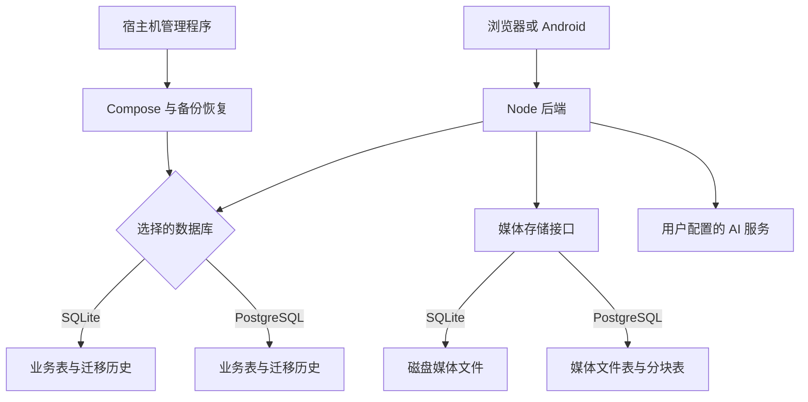

# 实现细节：从操作到代码

这个目录写给想理解 Love 如何工作的读者。每篇先说明要解决的问题，再沿一次真实操作解释数据和控制流程。图中实线表示调用、状态变化或数据关联；是否在事务内会另行标明。图是阅读辅助，代码链接才是具体实现入口。

第一次阅读建议从启动、数据库、迁移和备份开始，再看你要修改的业务。这里只描述已经实现的机制；假设的新版本会明确写成例子。

| 想弄明白什么                             | 阅读顺序                                     |
| ---------------------------------------- | -------------------------------------------- |
| 客户端怎样保存会话、处理缓存和失败消息   | [客户端状态](client.md)                      |
| 日志如何记录、媒体怎样检查和安全清理     | [日志与维护](maintenance.md)                 |
| 从管理程序到后端启动，配置怎么生效       | [启动与部署](startup.md)                     |
| 一个请求怎样读写 SQLite 或 PostgreSQL    | [数据库、事务与连接故障](transactions.md)    |
| 改表后已有数据库怎么办                   | [表结构迁移的执行过程](schema-migrations.md) |
| 格式变了，旧备份如何读；失败时数据会怎样 | [备份与恢复全过程](backup-restore.md)        |
| 登录、验证码、注册、后台权限和密钥       | [认证与权限](authentication.md)              |
| 配对怎么隔离数据；消息如何去重与实时更新 | [配对、聊天与在线状态](chat.md)              |
| 图片视频从上传到发布、计费、读取和清理   | [媒体处理与存储](media.md)                   |
| 相册分页、ZIP 导出与事务导入             | [相册实现](album.md)                         |
| 公历、农历、重复事项和秒级时间           | [日程与日期](schedules.md)                   |
| AI 排队、图片输入、工具执行与重启后去重  | [AI 助手](ai.md)                             |
| Android 原生服务、断线重连和通知游标     | [Android 与后台通知](android.md)             |
| 测试提交如何成为管理程序、APK 和镜像     | [CI 与发布链路](delivery.md)                 |

字段查询分别看 [SQLite 表结构](../database-sqlite.md)、[PostgreSQL 表结构](../database-postgresql.md)；文件结构看[备份格式](../backup-format.md)。不要把流程图当作字段手册。

## 数据在哪里

浏览器和手机不是另一份服务器数据库。用户资料、消息和相册以服务器为准；本地保存登录、偏好和待发送内容。管理程序负责部署和维护，不代替后端处理聊天请求。

## 阅读代码时抓住三条边界

权限边界决定“谁能操作哪些数据”；事务边界决定“哪些改动一起成功或一起失败”；持久化边界决定“重启后能恢复什么”。这三条在聊天、媒体、AI 和备份里反复出现。遇到异常，先确定跨了哪条边界，再找对应恢复逻辑。
