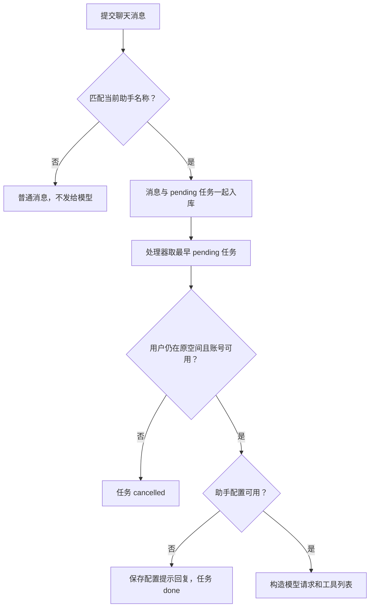
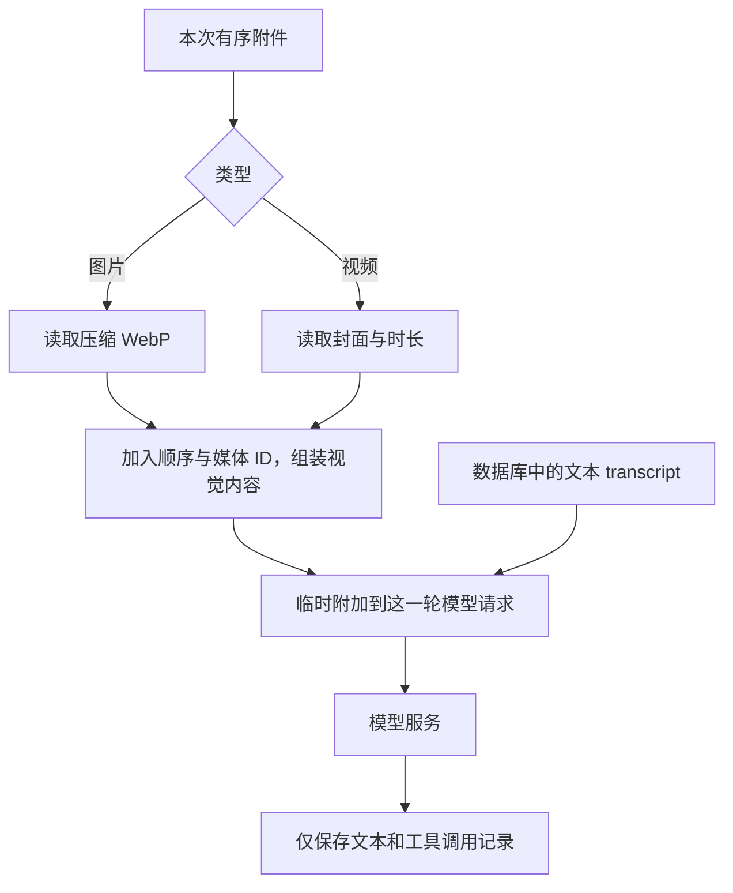
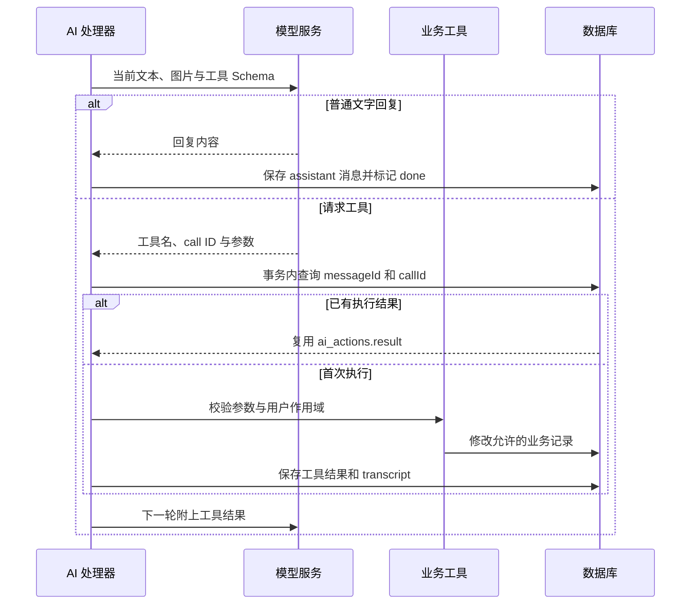
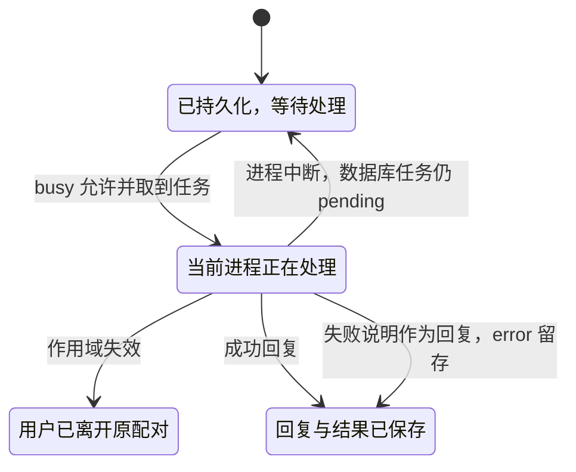

# AI 助手：从一句请求到有限的业务工具

AI 在 Love 中负责理解指令和选择业务工具，实际数据修改仍由服务端代码完成。模型不会取得通用数据库连接、Shell 或用户 token。工具是否允许执行，由当前用户和配对状态决定。

代码入口：[ai.ts](../../../apps/server/src/ai.ts)、[提及助手的匹配规则](../../../apps/server/src/schedules.ts)、[消息与任务入库](../../../apps/server/src/app.ts)。配置边界见[配置参考](../configuration.md#ai-与访问控制)。

## 为什么先保存消息再调用模型

模型请求可能慢、断网或失败，不能让聊天事务一直等它。消息与 ai_jobs 一起提交，处理器随后取 pending 任务。进程内 busy 标记避免当前后端同时处理多项任务；这不是跨多个后端进程的分布式任务锁。

提及必须是独立的 @当前名称，名称后接空格或标点，区分大小写。不是所有聊天都自动送给模型。配对双方共享助手设置；另一半修改配置后，后续任务读取当前设置。

## 图片如何进入请求，又为何不写入 transcript

本次附件按 message_media.position 顺序读取。图片取压缩预览，视频取封面并提供时长，通过 image_url data URL 传给视觉模型。模型不需要联网下载自建服务器的签名 URL，也不会收到原视频全部帧。

每轮请求重新读媒体组装图片，恢复任务也如此。Base64 不重复存入 transcript，避免任务表膨胀；但模型请求仍会向所选服务传送私人图片，用户说明必须交代这点。纯文本模型不能因工具名称存在就获得视觉能力。

## 一轮工具调用怎么安全执行

工具执行与结果记录在同一数据库事务内。messageId + callId 去重防止恢复任务时再次创建同一待办或重复删除。工具异常也作为结果返回，让模型知道操作没有成功，而不是凭自然语言宣称完成。

助手最多 5 轮，每轮最多 8 个工具调用，最后一轮指定不再选工具。这是成本与执行次数边界；没有无限循环到模型满意的行为。每轮还检查当前配对是否变化。

## 任务如何结束，以及哪些保证有限

Processing 是进程内执行阶段，不是当前实现必定写入的 running 状态。AI 失败时保存 error 和一条失败说明，再标记 done；不是自动无限重试。回复使用 clientId=ai:原消息ID 和唯一约束去重，任务结束与回复写入一起提交。

去重保证针对已有 callId；不能声称任意重启、任意模型重试都能获得分布式 exactly-once。尤其是模型重新生成不同 callId 或任务协调改成多实例时，仍需另行设计。修改这部分要检查工具、transcript 和消息唯一约束三处。

AI 服务地址有 SSRF 保护：默认 HTTPS，检查解析地址；内网例外必须由管理员明确允许主机。模型返回的数据和图片中的文字也是不可信输入，工具仍独立校验，不靠系统提示词代替权限代码。
