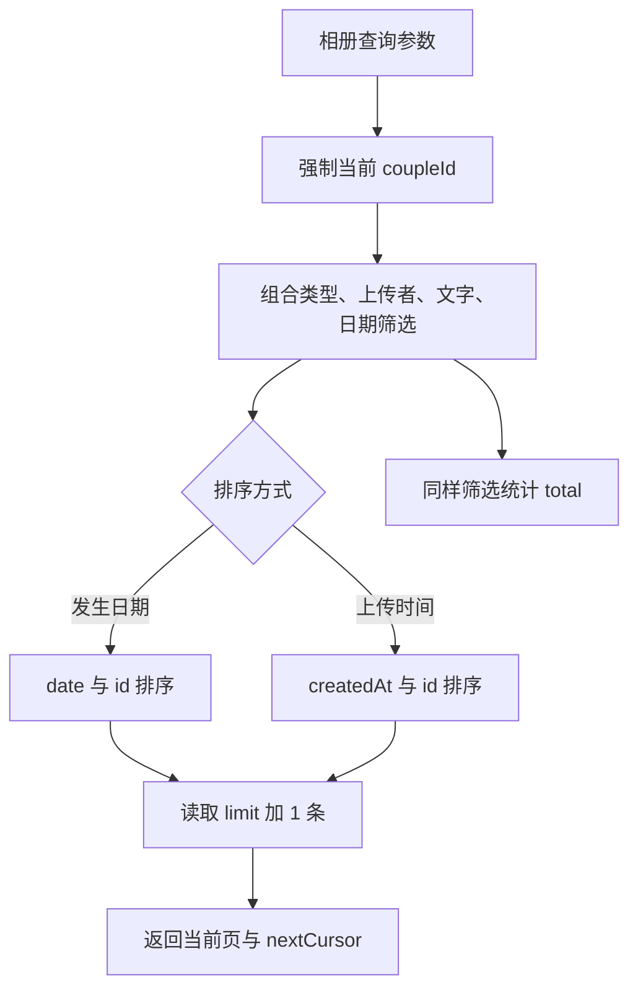
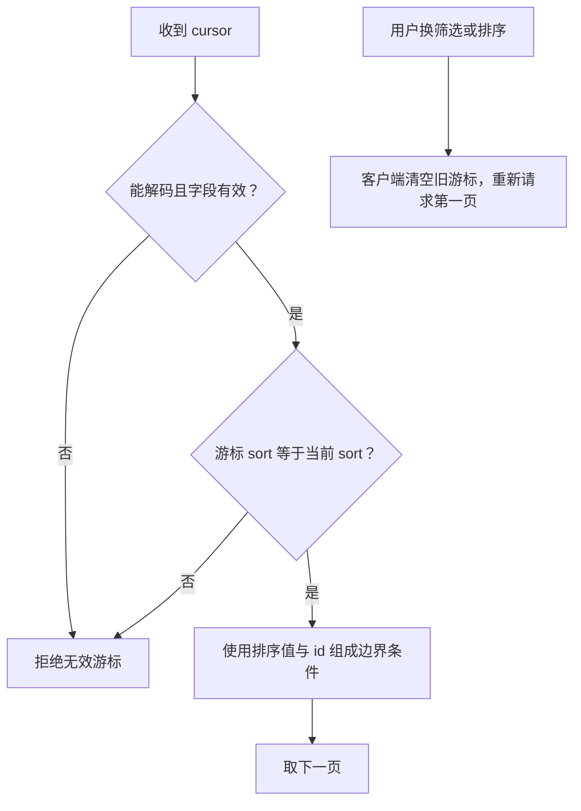

# 相册：筛选、分页与导出

相册条目 moments 保存“什么时候发生、描述是什么、用了哪份媒体”；媒体表保存文件。聊天和相册可以引用同一份媒体，不是每出现一次就复制一遍文件。

代码入口：[album.ts](../../../apps/server/src/album.ts)、[album-transfer.ts](../../../apps/server/src/album-transfer.ts)、[回忆 API](../../../apps/server/src/app.ts)。ZIP 字段见[文件格式手册](../backup-format.md#相册-zip)。

## 两个日期为什么不能混用

moments.date 是回忆发生的日期，可由元数据建议并由用户确认。createdAt 是上传时间，编辑发生日期不会改它。因此“按发生时间”与“按最近上传”会给出不同顺序，数据库为两种查询分别建索引。

搜索使用参数化查询，不把搜索文字当 SQL。当前空间条件先固定，即使 cursor 或其他参数被改也不会查询另一对情侣的记录。

## 游标如何处理同一天的多张照片

游标包含 sort、最后一条的排序值和 id，序列化为 base64url。下一页比较“日期更早，或同一天但 ID 更靠后”，不会只按日期切页而漏掉同一天的剩余记录。

游标是分页位置，不是权限凭据，也不是结果集的永久快照。浏览过程中有人上传或编辑，后续页面可能变化。改筛选时客户端必须重新开始，不能认为一个旧游标适用于任意查询。

## 导出

导出查询整个当前两人空间的相册。照片转换为 JPEG，视频输出 H.264/AAC MP4，实况输出静态 JPEG 与视频 MP4。使用已有预览，不包含缩略图、原文件包、JSON 清单、聊天或账号数据。用户相册导入接口已删除；管理程序的服务器备份恢复保持独立。

导出接口给出有效期 20 分钟的签名 URL，下载时再次核对原会话和配对。媒体由 SQLite 文件或 PostgreSQL 分块流入 ZIP，不先把整个相册放进内存。

## 实况照片

media.kind 新增 live（既有 TEXT 列），original 保留安卓实况原图或苹果两份原文件的 ZIP 源包；preview 为 MP4，thumbnail 为最高 1600 像素的静态 WebP。沿用原有三文件容量、数据库分块、清理、备份合同，不修改已发布迁移。

客户端为 live 提供 previewUrl（静态）与 motionUrl（视频）。图片筛选包含 live。安卓根据 XMP 的 Item Length 或旧 MicroVideoOffset 提取视频，校验 ftyp 后通过 ffprobe/ffmpeg 转码；Apple HEIC 使用 libheif WASM 解码为 RGBA，再生成 WebP，保留原文件的拍摄元数据。测试用 HEIC 为自生成的 64×48 纯色图片。苹果同名照片与 MOV 在上传表单中分别使用 file 和 liveVideo。原始 MOV 在转码前暂存供源包保存，处理结束清理暂存文件。

双方对当前空间的回忆、消息、日期、待办和 AI 设置均可修改；ownerId/senderId 保存来源身份而非编辑权限。上传草稿仍需由创建者发布或取消，个人头像只能由本人修改。

## 默认 AI 头像资源

使用内置 imagegen 生成，最终资源位于 `apps/client/public/images/ai-avatar.webp`。生成提示：为 Love 极简情侣应用绘制亲切的圆润深绿小伙伴，柔和黏土风、米白背景、暖金小星光，居中半身，留出圆形裁切余量，32 像素仍能识别；无文字和水印。生成图压缩为 256 像素 WebP，在聊天、提及候选和设置页作为默认头像。
