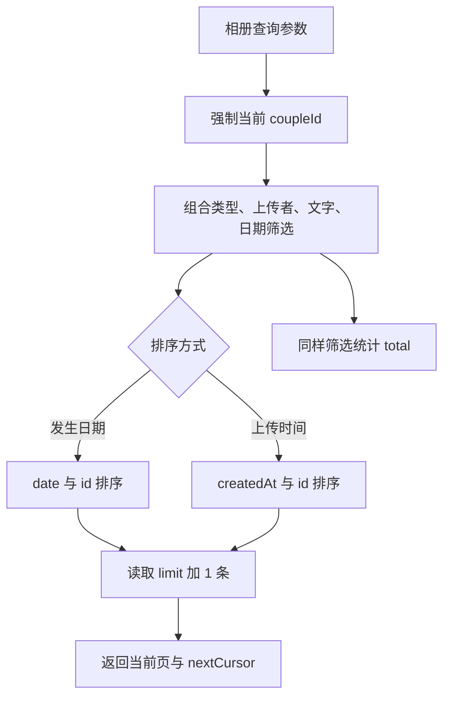
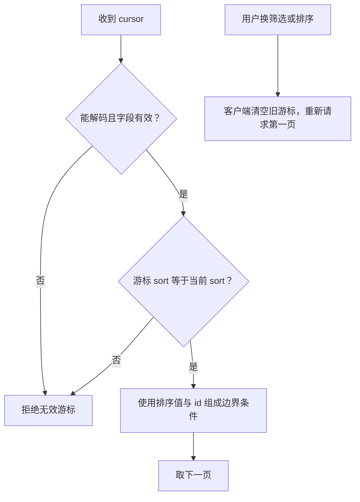
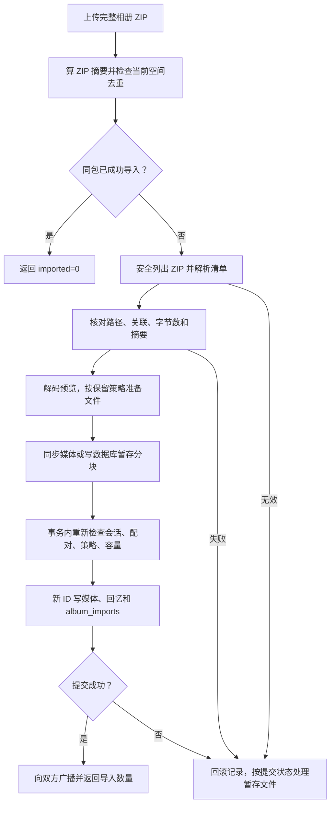

# 相册：筛选、分页、导出与导入

相册条目 moments 保存“什么时候发生、描述是什么、用了哪份媒体”；媒体表保存文件。聊天和相册可以引用同一份媒体，不是每出现一次就复制一遍文件。

代码入口：[album.ts](../../../apps/server/src/album.ts)、[album-transfer.ts](../../../apps/server/src/album-transfer.ts)、[回忆 API](../../../apps/server/src/app.ts)。ZIP 字段见[文件格式手册](../backup-format.md#完整相册-zip)。

## 两个日期为什么不能混用

moments.date 是回忆发生的日期，可由元数据建议并由用户确认。createdAt 是上传时间，编辑发生日期不会改它。因此“按发生时间”与“按最近上传”会给出不同顺序，数据库为两种查询分别建索引。

搜索使用参数化查询，不把搜索文字当 SQL。当前空间条件先固定，即使 cursor 或其他参数被改也不会查询另一对情侣的记录。

## 游标如何处理同一天的多张照片

游标包含 sort、最后一条的排序值和 id，序列化为 base64url。下一页比较“日期更早，或同一天但 ID 更靠后”，不会只按日期切页而漏掉同一天的剩余记录。

游标是分页位置，不是权限凭据，也不是结果集的永久快照。浏览过程中有人上传或编辑，后续页面可能变化。改筛选时客户端必须重新开始，不能认为一个旧游标适用于任意查询。

## 导出为什么与页面筛选无关

导出查询当前整个两人相册。普通照片 ZIP 将照片转换为 JPEG，跳过视频；完整 ZIP 保存清单及相册引用的媒体文件，可以再次导入 Love。不会导出其他聊天附件、账号或服务器配置。

导出接口先给签名 URL，下载时再次核对原会话与配对。签名有效期内开始下载，服务端流式输出 ZIP，不把整个相册先放进一个内存 Buffer。不同于服务器备份的 tar.zst，相册仍使用 ZIP，方便普通文件管理器打开。

## 完整 ZIP 如何避免半份导入

文件清单必须和引用吻合，缺文件、重复 ID、未知文件或摘要不一致均拒绝。导入者成为当前空间里这些回忆的发布者，日期、描述和原上传时间保留；来源作者文本不会变成跨服务器用户关联。

预检查额度后，事务内还要再检查一次。处理期间另一个上传可能消耗空间，用户也可能修改是否保留原文件。确认提交结果之前不能无条件删除文件，处理原则与普通媒体一致。

ZIP 摘要只为“完全相同的包”去重。重新导出会得到另一个包，不是跨服务器全局内容去重。相册格式当前为独立版本 1，服务器备份格式升级不会自动升级它的读取器。
