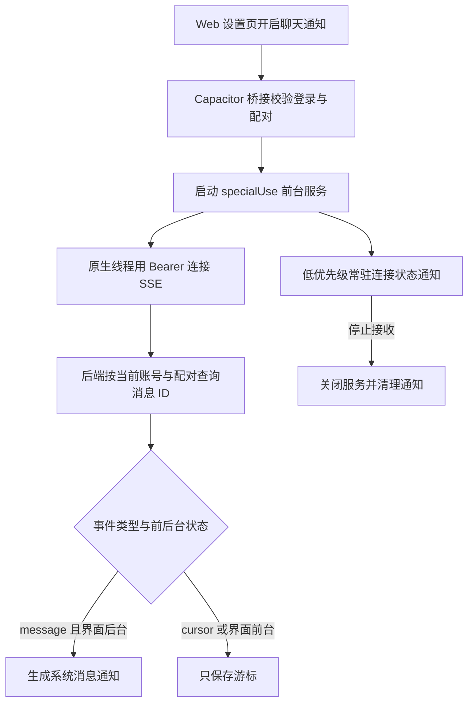
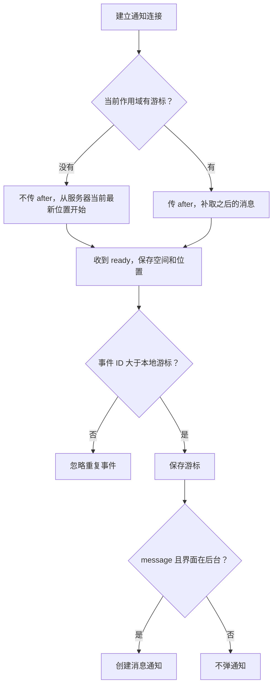
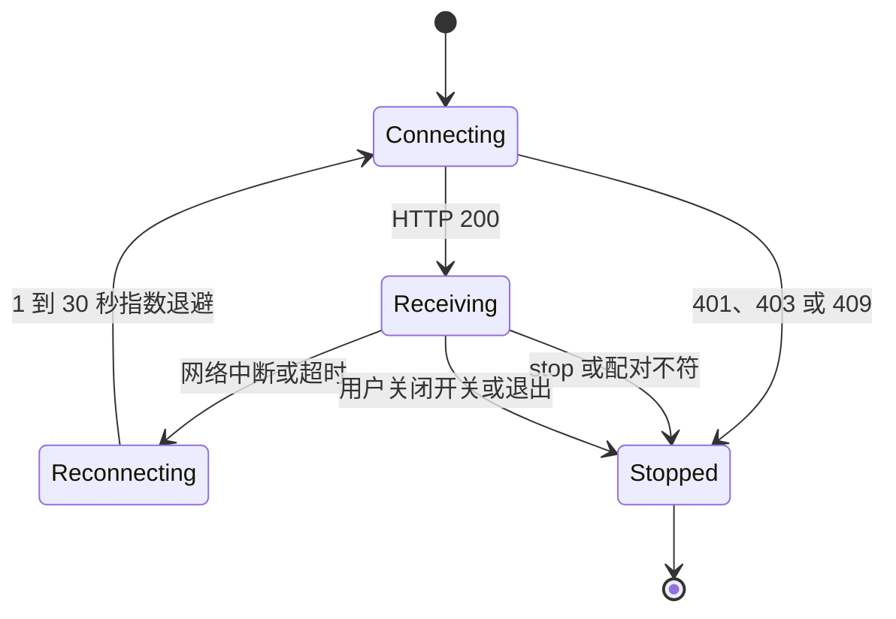

# Android：Web 界面与原生后台通知如何配合

Android 用 Capacitor 承载同一套 Web 界面，原生代码补上后台连接、本地通知、文件分享和返回键处理。聊天数据仍在服务器，没有另建手机数据库来替代后端。

代码入口：[原生通知服务](../../../apps/client/native/LocalNotificationService.java)、[通知桥接](../../../apps/client/native/LocalNotificationsPlugin.java)、[MainActivity](../../../apps/client/native/MainActivity.java)、[服务端 SSE](../../../apps/server/src/notifications.ts)、[生成 Android 工程](../../../tools/android/prepare.mjs)。

## 用户开启通知后有哪些组件参与

specialUse 是用户明确开启、带可见停止操作的前台服务，不是不可见的无限后台进程。常驻状态通知与新消息通知使用不同频道。消息正文固定为提醒文字，SSE 不传聊天正文和附件。

## 断线重连怎样避免重复与混入旧空间

游标键由服务器地址、用户 ID、coupleId 的 SHA-256 组成。它不能只按一个全局 lastMessageId 保存，否则切换服务器或重新配对会沿用错误位置。

第一次开启不弹历史通知。自己的普通消息和已经读过的消息由服务器发 cursor 事件，只推进位置；助手回复虽然关联发起用户，也可作为需要提醒的消息。前台时原生服务不再生成重复系统提醒。

服务器最多接受每位用户 5 个连接，每 15 秒核对会话与配对并发送心跳。查询一次最多 100 条，后续检查继续推进。响应积压过多会断开慢连接，不能让一个不读事件的设备无限消耗内存。

## 网络失败与权限失效为什么走不同分支

网络断了可以等待重连；账号或配对失效就停止，不能拿旧 token 无限请求。切换作用域时服务递增 generation，中断旧线程，异步关闭旧连接，避免阻塞 Android 主线程或旧线程继续弹通知。

前台服务不提供进程终止后的远程唤醒，也没有开机自启动。系统电池策略和深度休眠仍可能中止或延迟连接；重新打开应用恢复已开启服务。CI 验证 Manifest 和 DEX 不能证明所有手机锁屏下都及时送达。

## 打包与更新不是另一套应用身份

android:prepare 把 native 源码复制进生成的 Android 项目，并生成 Manifest、图标和版本配置。修改原生功能要改 native 与生成脚本，不能只改生成目录。

包名固定 com.kevinhuang.love，WebView origin 固定 https://localhost。更新要求签名一致、versionCode 不降低；服务器地址是登录页运行时选择，不需要每个服务器重新打 APK。签名流程和真实设备检查见 [Android 构建](../android.md)。
