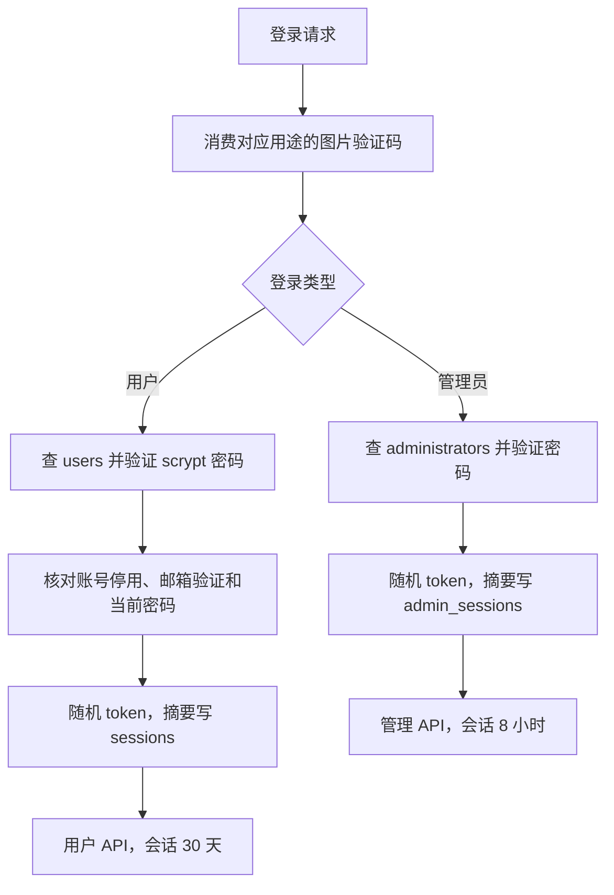
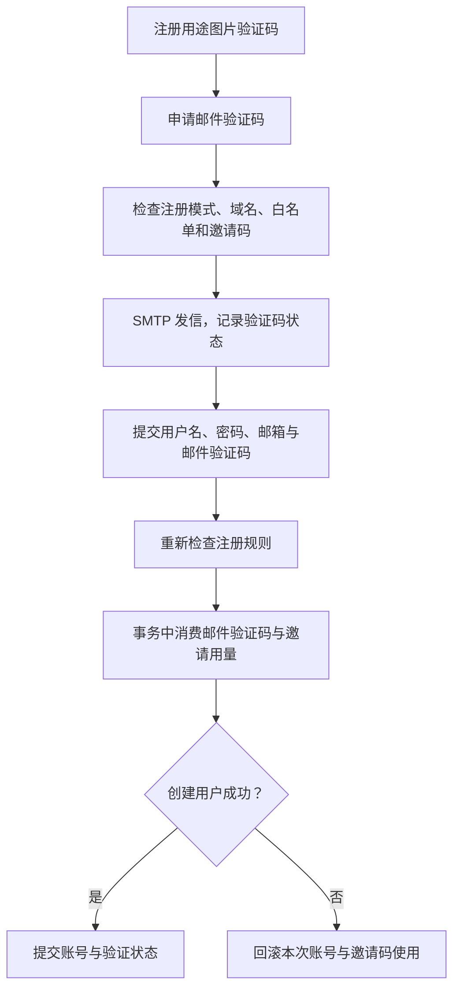
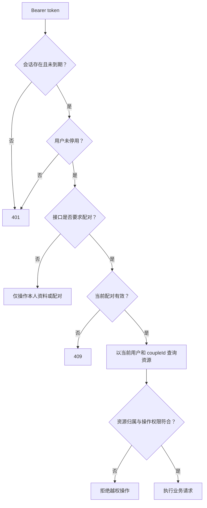

# 认证与权限：服务器如何知道你是谁

登录 token 是随机的通行凭据。客户端保存明文 token，服务器数据库只存其摘要；每个请求先核对 token、有效期和用户状态，再决定能操作的空间。密码则用 scrypt 保存带盐摘要，不能像配置密码一样解密出来。

代码入口：[security.ts](../../../apps/server/src/security.ts)、[control.ts](../../../apps/server/src/control.ts)、[app.ts](../../../apps/server/src/app.ts)、[mail.ts](../../../apps/server/src/mail.ts)。请求字段见[接口参考](../api.md)。

## 普通登录与管理员登录是两套会话

管理员 token 不会变成普通用户 token，普通 token 也进不了后台。管理员凭据由部署环境同步，修改环境里的账号或密码后旧管理会话撤销；用户资料和注册控制则在数据库里。

登录有请求频率限制。密码计算完成后还重新读取当前密码和停用状态，避免计算期间管理员改了密码，旧密码仍被接受。

## 图片验证码与邮件验证码解决不同问题

图片验证码绑定 login、register、reset 或 admin 用途，还绑定请求来源；消费后失效。邮件验证码证明邮箱控制权。取得邮件验证码不等于已经创建账号。

规则在最终注册时重新检查，不能因为几分钟前允许发送邮件就忽略管理员刚关闭注册。邀请码次数的条件更新和账号创建处于同一业务事务，避免并发请求越过限额。邮件验证码有到期和尝试次数限制，注册和找回密码的验证码不能混用。

SMTP 接收发信请求不等于邮件已到收件箱；网络和邮箱服务仍是外部系统。相关错误先记录为发送失败，而不是凭空创建已验证账号。

## 每个请求怎样检查数据归属

客户端提供的 ID 只是要查的资源编号，不是授权证明。修改回忆还要检查发布者；AI 改个人资料只允许改发起人；配对共享设置双方可以改。长连接也需要重新检查，不能仅在第一次握手成功后永久信任。

密码恢复、停用账号、撤销会话会使既有会话无效。Socket.IO 和 SSE 对应连接也会关闭或在校验时结束。签名媒体链接走签名与当前资源检查，不依靠把磁盘目录公开给所有人。

## 不能混为一谈的三种秘密

| 内容              | 数据库表示       | 能否恢复明文                |
| ----------------- | ---------------- | --------------------------- |
| 用户和管理员密码  | scrypt 带盐摘要  | 不能，只能重设              |
| 会话与邀请 token  | SHA-256 摘要     | 不能；随机 token 已有足够熵 |
| AI Key、SMTP 密码 | AES-256-GCM 密文 | 可用正确的服务密钥解密      |

服务密钥还参与签名与验证码摘要。备份恢复必须带来源密钥并重新加密到目标密钥，见[备份恢复](backup-restore.md)。不要把“用户密码不能解密”误套到服务调用必须使用的 AI / SMTP 凭据。
