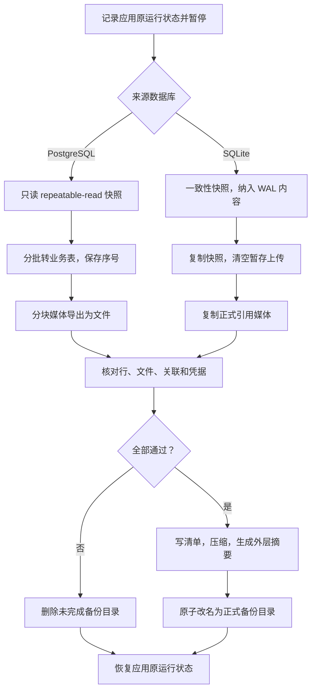
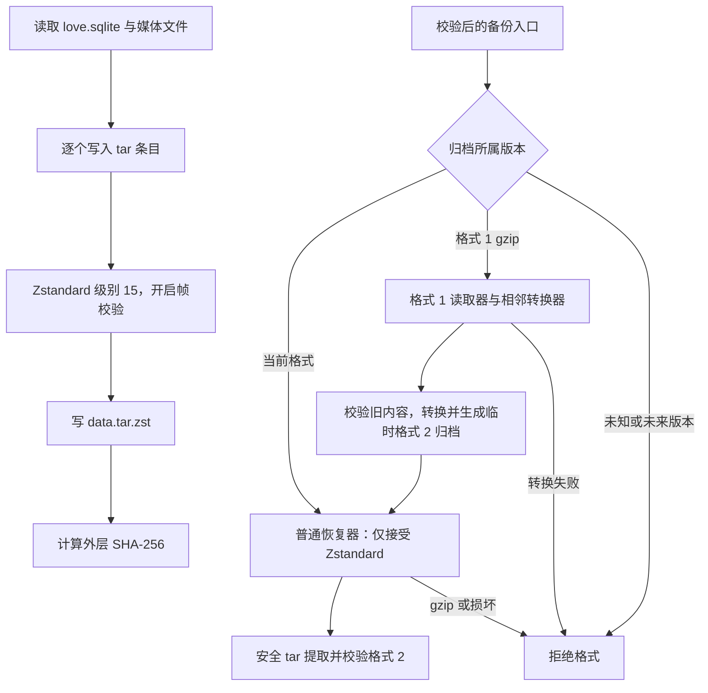
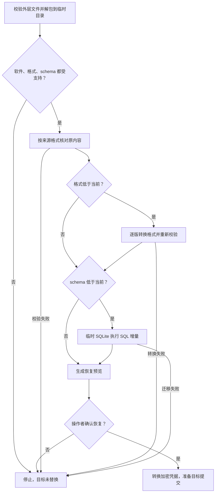
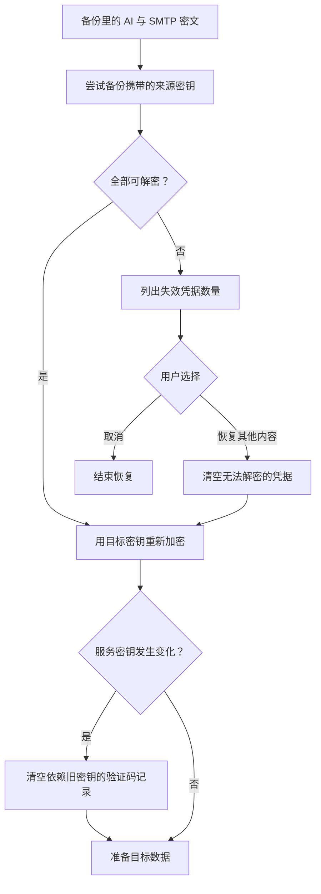
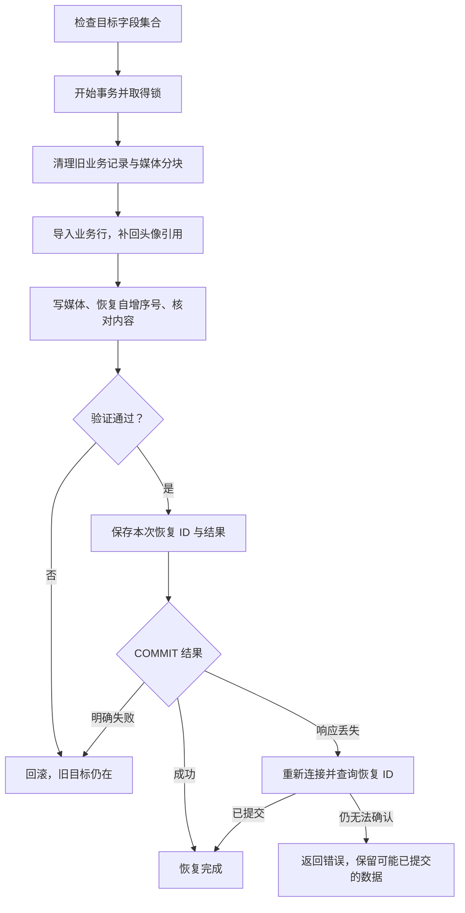
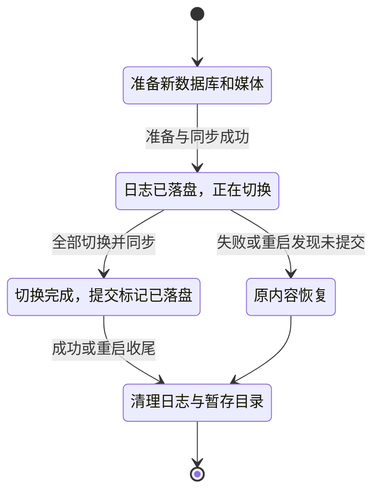

# 备份与恢复：从原数据到新服务器

备份首先要回答“数据是否完整”，恢复还要回答“版本能否理解、密钥能否解密、替换失败是否能保住目标”。只打包几个文件无法回答这些问题，所以实现分成快照、校验、迁移、凭据转换和目标提交。

代码入口：[database-backup.ts](../../../apps/server/src/database-backup.ts)、[database-restore.ts](../../../apps/server/src/database-restore.ts)、[格式注册表](../../../apps/server/src/backup-format.ts)、[通用归档调度器](../../../apps/server/src/backup-package.ts)、[管理程序](../../../deploy/manager.mjs)、[tar 打包](../../../deploy/archive.mjs)。文件字段见[备份格式手册](../backup-format.md)。

## 生成备份：为什么暂停应用

SQLite 的数据库和磁盘文件不是一个整体快照。数据库引用了一张照片，但打包时它被另一个请求删除，就会产生缺文件备份。管理程序因此暂停本部署的 love 服务，完成或失败后恢复原运行状态；原来没运行的服务不会被意外启动。

快照一律采用 SQLite 表达，来源是 PostgreSQL 也不直接保存数据库数据目录或 pg_dump。这样恢复器只有一种业务读取方式，再由目标适配层重建 SQLite 文件或 PostgreSQL 表与媒体分块。

临时备份目录以 .backup- 开始，生成完整内容后才改成正式备份目录。中途失败不会把半份归档展示成可用备份。备份同时验证 AI / SMTP 凭据能否用随备份保存的配置解密；有失效凭据时先要求修复，避免“备份成功、恢复时才发现密码没法读”。

暂停只覆盖本部署服务。若另一个进程也写同一数据库或媒体，部署方必须协调暂停；当前系统不是多写入者的全局备份调度器。

## 压缩流水线怎样控制内存

流式处理让读、压缩、写受下游速度约束，大文件不会一次读成 Buffer。编码器仍有自己的工作内存，级别 15 比默认级别更偏向节省空间，不等于零内存或无限压缩。现有 WebP 和 MP4 不做有损重编码，所以很可能不会明显缩小。

## 导入时三条版本规则怎么组合

例如来源应用 2.9.2、格式 1、schema 1，目标应用 2.9.3、格式 2、schema 1：只做格式转换，不跑新的 SQL。假设未来目标 schema 2，则格式转换成功后再执行 002。来源软件较新时，即使 schema 和格式碰巧没变，也拒绝导入；这是软件方向限制。

格式 1 → 2 把数据库摘要与报告移动到 integrity，并记录算法版本。它不改来源软件版本、schema、媒体字节或用户数据。新导出使用 Zstandard 级别 15；旧 gzip 只由格式 1 的版本模块解码；清单升级后，在私有目录中重打包成真正的格式 2 Zstandard 归档，再进入普通恢复流程。原归档不改写。框架还强制检查这些来源字段没有被转换器改写。

原 tar.gz / tar.zst 和 deployment.env 不修改。底层校验函数可能更新工作目录中的清单和数据库，因此管理程序先解包成私有副本；修改维护脚本时必须保留这条边界。

## 解密为什么用来源密钥，保存为什么用目标密钥

SMTP 密码和 AI Key 以服务密钥加密。新服务器的 MEDIA_SIGNING_SECRET 不一定等于旧服务器，所以先尝试备份 env 和快照内部保存的来源密钥，成功后再使用目标密钥加密。

“恢复其他内容”不会把失效密文当明文保存，也不会清空仍能解密的凭据。媒体没有用这些 AI / SMTP 密码加密，所以它们失效不等于照片丢失。目标数据库地址、代理和管理员部署配置保持当前值，启动时管理员凭据会按目标环境同步。

## 写入 PostgreSQL：清空、导入和核对在同一事务

恢复器先确认目标字段集合与快照一致，再获得写事务锁。事务里清理旧数据、按依赖顺序导入、写媒体分块、设置序列并核对行摘要和媒体字节。用户头像引用媒体，形成循环引用，先让头像为空，媒体导入后再填回头像 ID。

内部 database_restores 表用于最后的结果证明，不是用户业务表，不从源备份复制。恢复时把 SQLite 的两列 REAL 值存为 PostgreSQL DOUBLE PRECISION，避免单精度损失导致摘要不符，具体见[字段手册](../database-postgresql.md)。

## 写入 SQLite：文件切换为什么有日志

数据库文件和整个媒体目录不能靠一个 rename 同时替换。恢复器先在目标同一文件系统准备完整的新文件，fsync 后记录 .love-restore.json，再逐项把旧内容移动到暂存 old/、把新内容移到正式位置。所有切换持久化后，才把日志标记为 committed。

下次后端启动先处理日志：未 committed 则回到旧文件，已 committed 则保留新文件并收尾。日志列出数据库、wal、shm 和 media 的状态，路径也要核实，不能盲目按任意 JSON 删除目录。

这不是软件版本回滚功能，而是一次恢复操作的失败保护。数据库已经升级后不支持运行旧版软件降级。

## 一次恢复应怎样验证

检查用户和配对、聊天及附件顺序、照片视频字节、日程、头像、AI / 邮件凭据以及自增高水位。测试还比较源归档和源清单恢复前后的字节，证明临时迁移没有动原备份。自动测试覆盖中途失败、文件切换中断和 PostgreSQL 提交响应丢失；操作后也应通过客户端抽查业务。

## 为什么新增格式不必改管理程序

管理程序调用公共导入入口，不再直接判断 gzip 或格式编号。入口从注册表选择归档读取器，逐版调用转换器和校验器，再将当前模块给出的数据库与媒体路径交给恢复器。导出也从最新模块取得清单生成规则和打包器。每个版本完整负责自己的文件含义，公共调度器只负责顺序和失败边界。接口与扩展测试见[迁移开发约定](../backup-migrations.md)。
