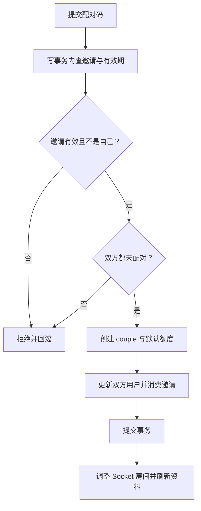
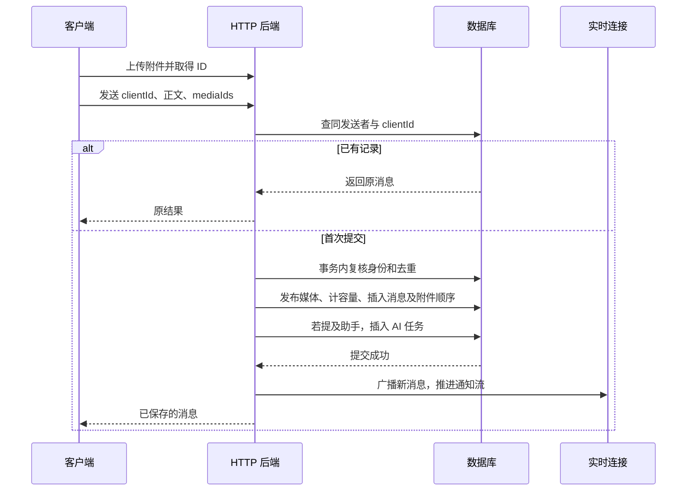
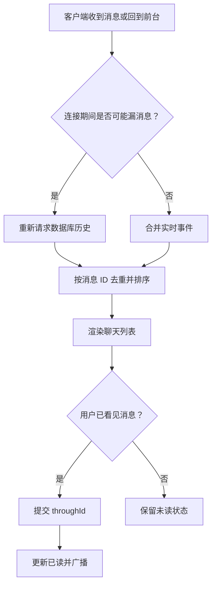
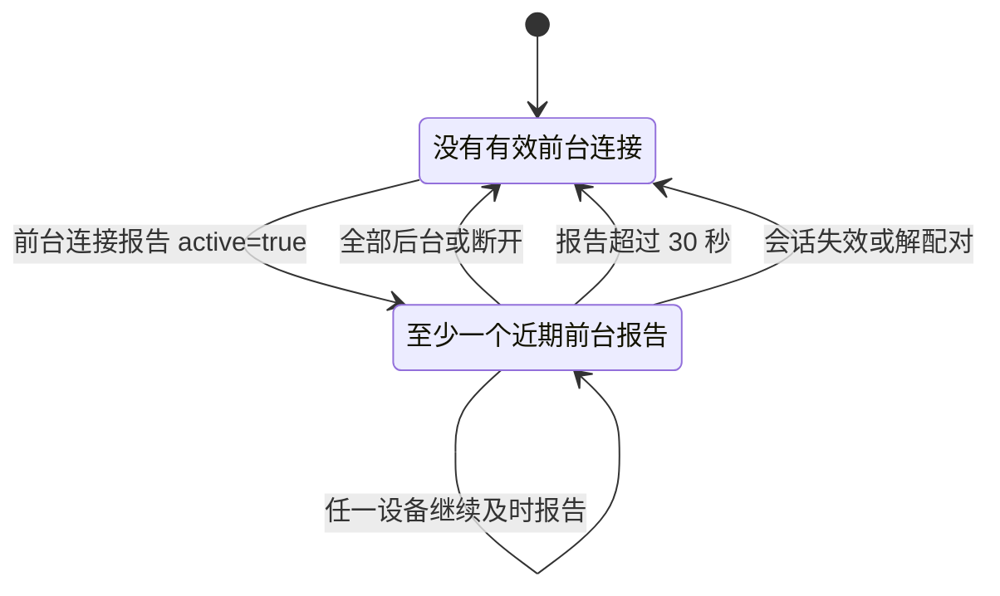

# 配对、聊天与在线状态

coupleId 是两人空间的边界。消息属于空间，用户当前指向空间；解除配对断开用户关联，原空间和消息保留。重新配对创建新 ID，不自动合并旧内容。

代码入口：[app.ts](../../../apps/server/src/app.ts)、[presence.ts](../../../apps/server/src/presence.ts)、[客户端聊天辅助](../../../apps/client/src/lib/chat.ts)。字段查询看 [SQLite](../database-sqlite.md) 或 [PostgreSQL](../database-postgresql.md)。

## 配对如何避免三个人加入同一空间

创建邀请码要求发起者尚未配对。邀请码有效 10 分钟，明文交给用户，摘要入 invites。加入时事务内重新读取双方的当前配对状态，再创建空间和额度、更新两人、删除双方邀请码。

写事务串行检查意味着两个并发加入请求不能都依据事务外的“尚未配对”状态成功。解配对也在事务内核对当前空间，再把两人的 coupleId 清空；提交后关闭该空间的通知连接并让 Socket 离开旧房间。

## 一条带附件消息怎样落库

客户端为每条消息分配 clientId。先上传附件拿到媒体 ID，再经 HTTP 提交文字与有序 mediaIds。Socket.IO 是更新通道，不能代替这一提交接口。

数据库唯一约束是 senderId + clientId，而不是全局 clientId。重试必须沿用同一编号和已上传媒体，不能每次生成新 UUID。附件数组不接受重复 ID，也不能拿别人的媒体或其他空间的媒体来引用。

事务内再次查询会话和配对，是为了处理上传期间被停用、解除配对或更换空间的情况。媒体关联失败会让整条消息回滚，不能只保留半组附件。

## 已读、重连与持久化来源

历史请求按消息 ID 取最近 50 条，服务器查询时倒序，返回时反转为升序。before 表示再往前取一页。已读更新只标记当前空间、另一方发送、ID 不大于 throughId 且原来未读的消息。

实时事件可能在客户端断线时丢失，数据库记录不会因为没有人在线就丢失。待发送内容按服务器、用户和配对隔离，失败重试不能把旧空间的待发送消息带到新空间。

## 在线不是“手机有网络”

每个前台 Socket 每 10 秒报告 active。服务器使用自己的接收时间，最近 30 秒内任一有效前台连接报告为 true，就认为该用户在线。服务端每 5 秒复核。后台 SSE 收消息不计在线。

这解决“App 退后台但 Socket 暂时没断，所以一直在线”的问题。多设备中只要还有一台正在前台使用，就可以在线；不是一个后台开关覆盖所有设备状态。
