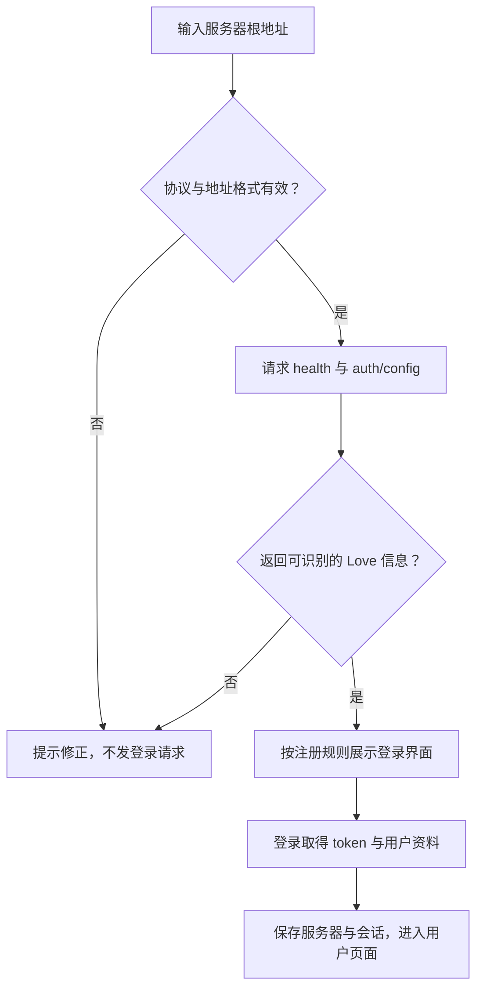
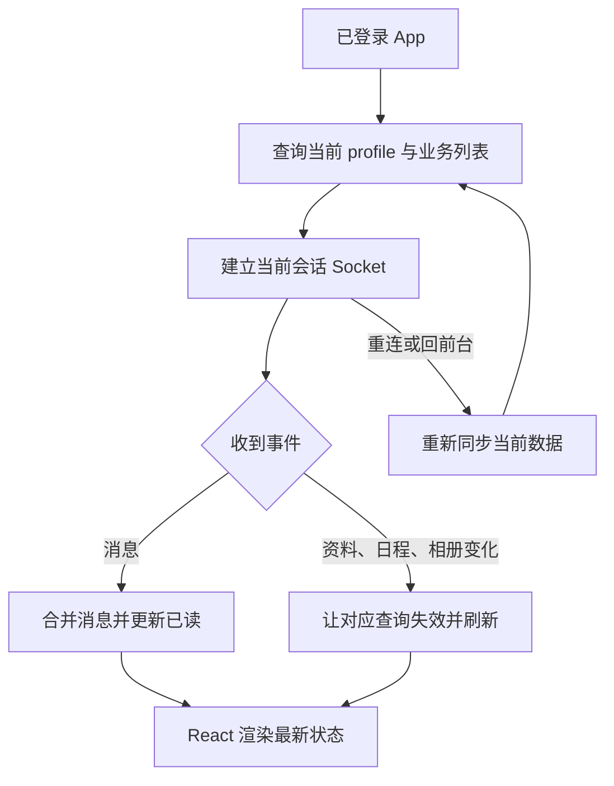
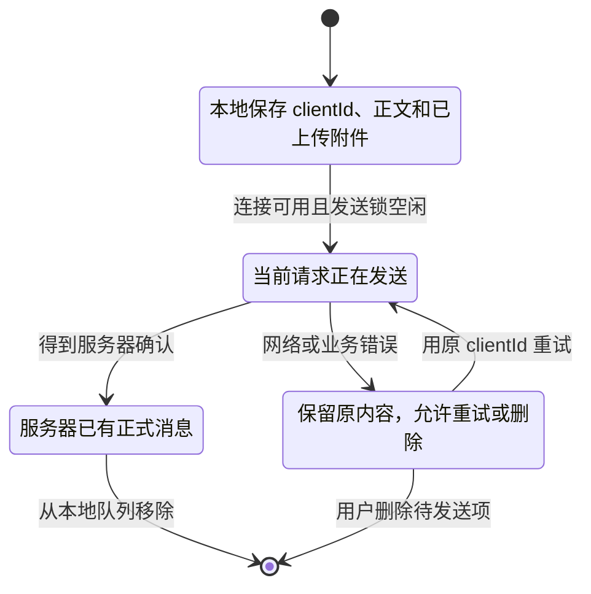

# 客户端：会话、页面数据与待发送消息

客户端展示和缓存服务器结果，同时处理网络失败与用户操作。它不会因为页面上已经显示“待发送”就把消息视为服务器保存成功。Web 与 Android 使用同一套页面和 API 类。

代码入口：[App.tsx](../../../apps/client/src/App.tsx)、[api.ts](../../../apps/client/src/lib/api.ts)、[Chat.tsx](../../../apps/client/src/pages/Chat.tsx)、[Auth.tsx](../../../apps/client/src/pages/Auth.tsx)、[返回导航](../../../apps/client/src/lib/back-navigation.ts)。

## 服务器地址与会话是怎样建立的

normalizeServer 拒绝凭据、查询参数、hash、非根路径和 0.0.0.0 等监听地址，最后规范成 origin。不能填 /api，也不能把手机 localhost 当成服务器地址。服务器名合法仍不证明网络通；测试连接再确认健康与认证配置。

请求类统一加 Bearer、JSON 类型和错误处理。普通 fetch 有 20 秒超时；FormData 上传不套这个短超时，大视频另外支持进度和取消。收到 401 且当前有 token，会触发清除失效会话。网络错误与服务器业务错误给出不同说明。

## 页面为什么在实时事件后还要重新取数据

Socket 事件是提醒，数据库查询是持久化来源。资料变了可能意味着配对也变了，不能只改一个显示昵称而继续沿用旧空间缓存。前台状态由网页可见性与 Android 原生 active 状态共同决定，再上报在线状态。

React 不每秒向服务器要计时结果；Duration / useClock 在本地刷新日期显示。主题等设备偏好保存在本地，业务设置则经 API 保存。

## 待发送队列如何与服务器去重配合

队列键包含服务器、用户和 coupleId，最多保留 100 条待发送项。附件上传成功后保存其 ID，不因消息请求失败就从头上传。发送锁避免当前页面同时处理多条队列项；服务器唯一约束负责最终去重。

最关键的情况是“服务端成功，但响应断了”：本地仍可能显示失败，重试同一 clientId 会拿到原消息，而不是多发一条。换服务器或解除配对后，旧队列不能以新身份自动发送。

## UI 行为在哪里改

聊天在 Chat，相册在 Memories，配对与设置在 Us，日程在 Dates / Todos，后台在 Admin。共享控件与媒体预览在 components。返回键先处理键盘、预览或弹层，再回聊天，最后退后台；它不等于退出登录。

新 UI 流程先保证业务状态与失败操作清晰，再实现视觉效果。上传进度表示字节传输阶段，不等于媒体转码、容量检查和发布全部结束，不能在进度 100% 时提前宣告保存成功。
