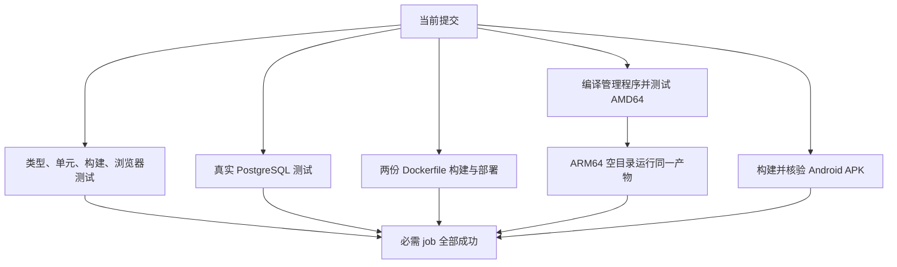
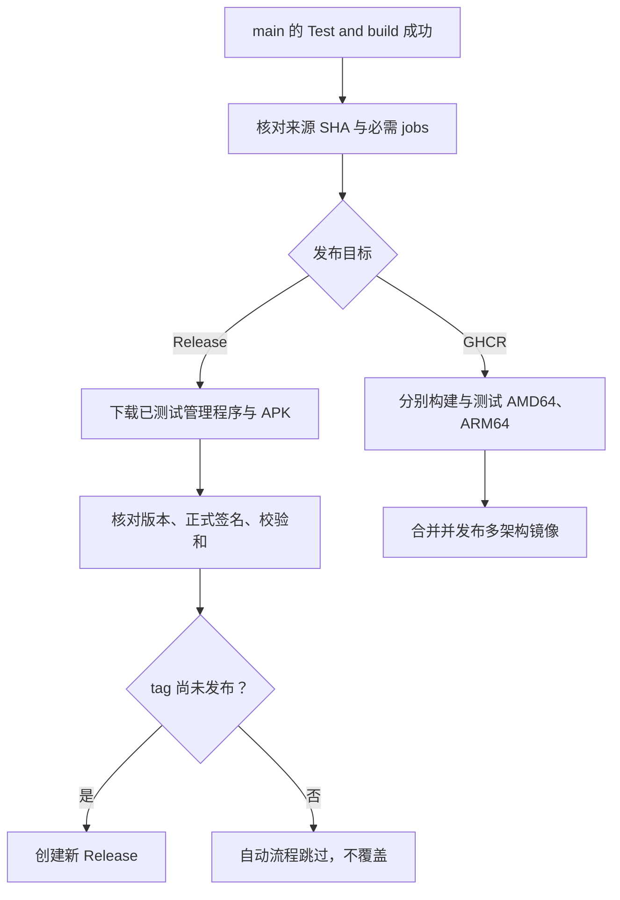
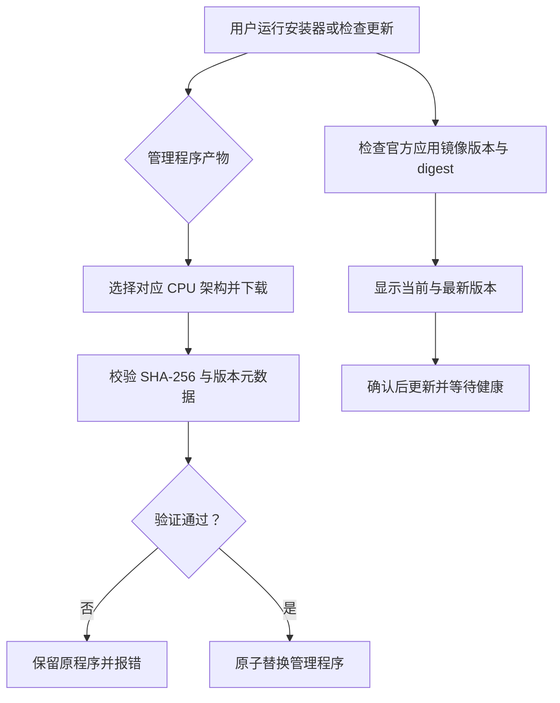

# CI 与发布：怎样保证测试的是实际交付的代码

本地通过不等于用户最终下载的二进制可用。Love 的 CI 同时检查源代码、真实数据库、容器、独立管理程序与 APK；发布流程再核对测试提交和产物来源。

代码入口：[CI](../../../.github/workflows/ci.yml)、[镜像发布](../../../.github/workflows/containers.yml)、[Release](../../../.github/workflows/release.yml)、[管理程序构建](../../../manager/build.mjs)、[原生自测](../../../tests/manager/self-test.mjs)。命令和维护步骤见 [CI 参考](../ci.md)。

## 为什么需要多个测试环境

SQLite 测试不能证明 PostgreSQL 的类型、事务、分块和序列正确；源码测试不能证明 Bun 编译后的二进制带齐依赖；模拟网络不能代替真正容器网络。管理程序自测从空目录、干净环境运行，避免机器上残留项目文件掩盖漏打包。

备份压缩在 Node CLI 和 Bun 管理程序共用流式实现。自测实际生成 Zstandard 归档、解包、核对内容并恢复，两个架构都要跑。测试假证书用于检查部署流程，不代表真实域名证书申请已经成功。

## 三种产物如何分别发布

Release 使用构建产物，不在发布步骤另建一份未经相同检查的 APK。镜像是独立流程，发布时也验证来源提交。不能因为 APK 成功就推断容器成功，反过来也一样。

PR 的镜像验证不发布 GHCR；纯文档 PR 不触发额外 containers 工作流，但仍触发 Test and build 的 Docker job。合并前查看当前 head 的检查，不采用上一个提交的绿色结果。

## 安装和更新如何利用产物元数据

更新界面把管理程序和应用镜像分开显示。原生数据库维护要求两者版本一致，避免新管理程序提前迁移仍由旧应用使用的数据库。更新后没有软件版本回滚选项；恢复过程的失败回滚属于数据一致性保护，不是运行旧软件的入口。

更改版本号要同步 package 元数据、APPLICATION_VERSION、发布 tag 默认值和文档。应用版本、SQL 版本、备份格式版本独立，只有相应约定变化才增加各自编号。
