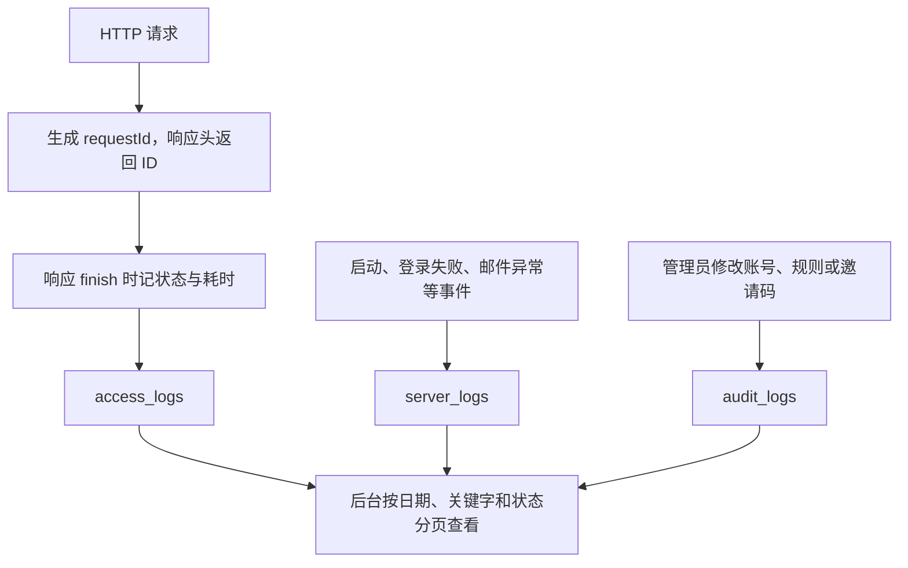
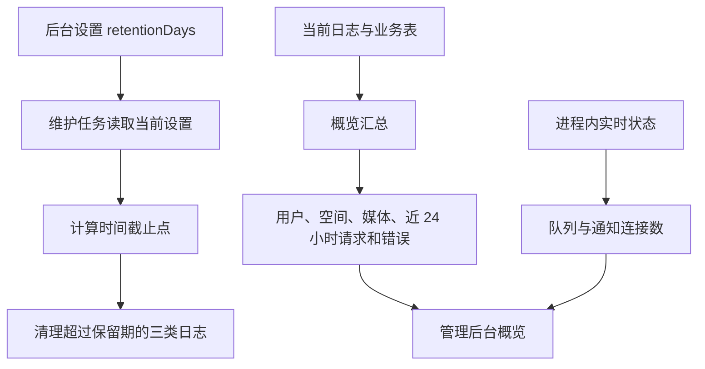
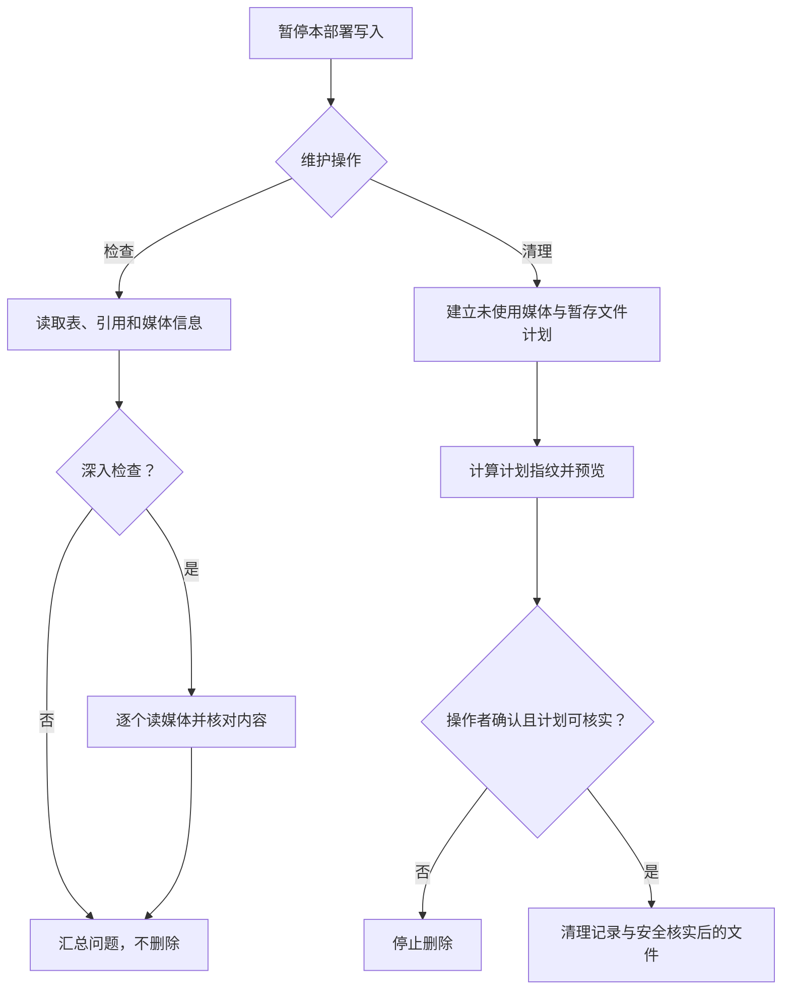

# 日志、检查与维护：怎样知道哪里出了问题

Love 记录请求、服务事件和管理员操作，三类日志回答不同问题。媒体一致性检查和清理另外负责核实数据库与实际字节；不能用“删掉旧文件”代替检查。

代码入口：[control.ts](../../../apps/server/src/control.ts)、[database-check.ts](../../../apps/server/src/database-check.ts)、[media-cleanup.ts](../../../apps/server/src/media-cleanup.ts)、[管理程序](../../../manager/manager.mjs)。

## 三种日志从哪里来

访问日志保存方法、路径、状态、耗时、IP、调用者和 User-Agent，不保存聊天请求正文或密码。相册签名下载的路径会遮掉下载标识，查询参数也不是访问日志的 path 字段。健康检查不记访问日志，避免轮询淹没业务请求。

日志仍可能包含 IP、账号和事件详情，因此不能视为公共信息。服务日志保存失败类别，管理员审计说明谁改了什么，不是用户聊天历史的替代品。

## 保留时间和概览怎样计算

有些概览来自数据库统计，有些来自当前进程。例如通知连接数随进程重启消失，不是历史上收到过通知的设备数量。日志写入由跟踪的异步任务完成，关闭时等待这些任务；无法打开数据库时还需查看容器标准错误输出。

## 一致性检查与清理是两个操作

常规检查核对记录、关联、媒体大小等信息，深入检查还实际读取媒体并核对摘要。检查只报告问题；清理先建立待删除计划、展示内容，再按确认的计划执行。

计划指纹让执行者知道确认的是哪一批内容。磁盘文件会核对文件身份等信息，避免扫描后路径变化造成误删；数据库引用包括聊天、回忆、个人和助手头像等，不能只检查 moments 一张表。

清理未使用媒体不会按日期删除正常照片。PostgreSQL 删除分块释放的空间供数据库复用，不保证底层文件立即缩小。Docker 镜像清理与媒体清理也是不同操作，不能用 volume prune 当作通用空间维护。

## 排错先确定发生在哪一层

| 现象                   | 先检查                                              |
| ---------------------- | --------------------------------------------------- |
| 客户端请求超时         | 地址、监听、路由、代理、跨域                        |
| 后端启动前失败         | 环境配置、恢复日志、数据库连接、迁移历史            |
| 媒体传输 100% 但未成功 | 转码、临时磁盘、策略变更、容量和最终提交            |
| 备份不能恢复           | 外层摘要、压缩帧、格式版本、schema 历史、媒体和密钥 |
| Android 锁屏不提醒     | 权限、电池策略、服务进程、SSE 连接与作用域游标      |

先定位，再对照相关实现章节。删除数据库或卷不会修复错误的网络和密码，也会让之后的排错失去原数据。
