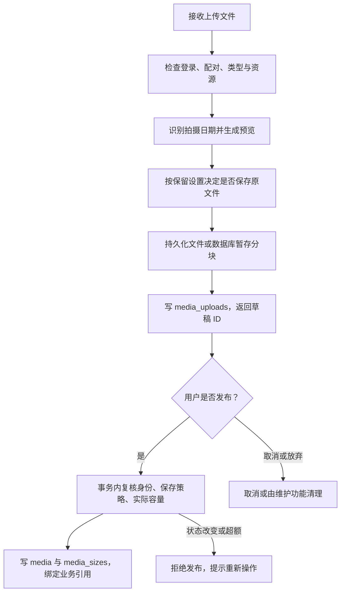
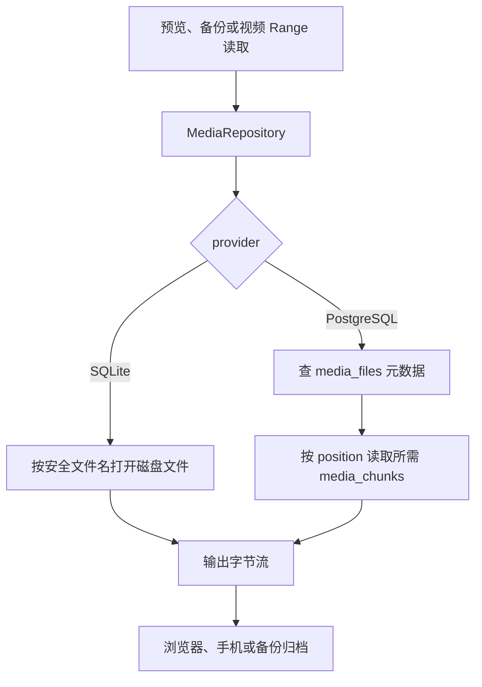
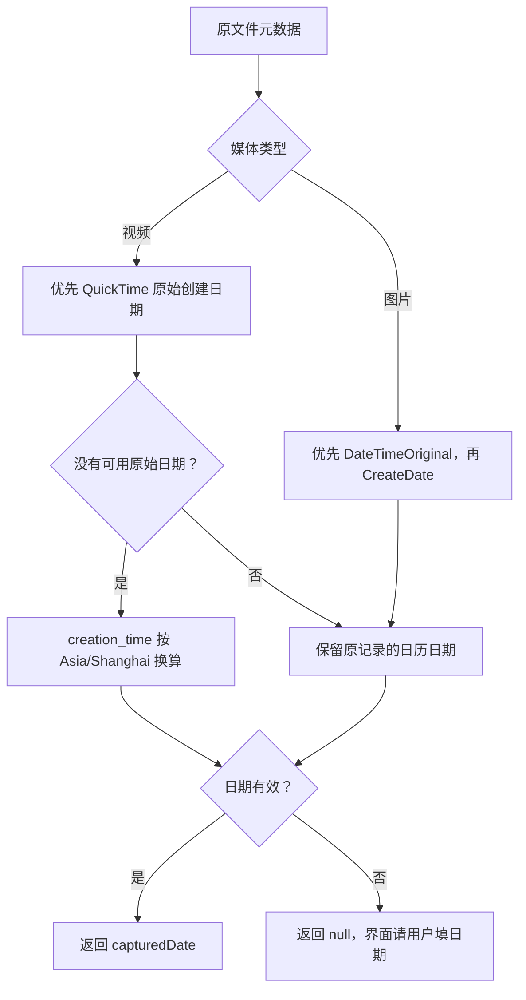
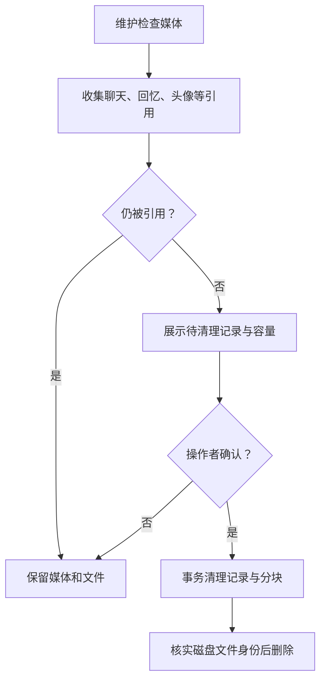

# 媒体：上传、发布、容量与读取

文件上传和“保存为聊天附件或相册”是两个阶段。这样用户选择文件后可以先预览、读取拍摄日期，再决定发布；失败重试也不必重新上传已经成功的文件。

代码入口：[media.ts](../../../apps/server/src/media.ts)、[capture-date.ts](../../../apps/server/src/capture-date.ts)、[媒体存储接口](../../../apps/server/src/media-repository.ts)、[草稿发布](../../../apps/server/src/media-drafts.ts)、[清理](../../../apps/server/src/media-cleanup.ts)、[上传 API](../../../apps/server/src/app.ts)。

## 一个文件何时变成正式媒体

上传完成时还不正式计入配额。发布 helper 与消息、相册或头像变更处于同一事务；检查通过后删除暂存记录。原文件保留策略在转码前读取，发布前再次比较，避免用户改了策略却默默保存另一种文件集合。

输入没有统一文件大小、像素和视频时长上限，但服务器临时磁盘、转码并发资源、代理限制和空间额度仍会让请求失败。不能把“不设固定大小”理解为无限容量。

个人头像另有专门接口，不要求配对、不占两人额度。普通聊天、相册和助手头像依赖两人空间媒体。不要把这两条上传路径合成同一个权限检查。

## 两种存储怎样提供同一个媒体 API

PostgreSQL 每块最多 1 MiB，文件完成状态与摘要在 media_files。文件名、媒体 ID、字节数和分块顺序都有作用；只取某一条 BYTEA 并不一定是一张完整图片。正式媒体和暂存媒体用同一分块存储，mediaId 是否绑定区分归属状态。

SQLite 发布前 fsync 文件与目录并核对大小。转码进程退出成功只说明处理完成，不证明内容已持久化。PostgreSQL 发布前检查完整暂存分块，并在事务中绑定到正式 media ID。

## 拍摄日期不是文件修改日期

不使用文件名、上传时间或文件修改时间猜测。坏元数据不会让可解码的照片必然上传失败。相册最终保存用户确认的 moments.date，上传元数据识别结果只用于建议。

## 配额和清理为何依赖引用

media_sizes 记录保留文件的实际容量，配额按空间的正式媒体汇总。发布在同一写事务核对 used + draft.totalBytes，防止并发上传分别看到同一剩余额度而一起超额。

维护程序暂停写入后预览和执行清理。普通删除接口不能删除仍被聊天、回忆或头像引用的媒体。文件系统删除和数据库提交的先后需要考虑提交结果未知，见[事务说明](transactions.md)：不能见到网络错误就把可能已提交的文件删掉。

签名访问用媒体 ID、variant 和过期时间计算 HMAC。后端校验签名再读取资源，不把整个 media 目录设成静态公开目录。视频 Range 只读所需范围，不要求下载整段视频后才能播放。
