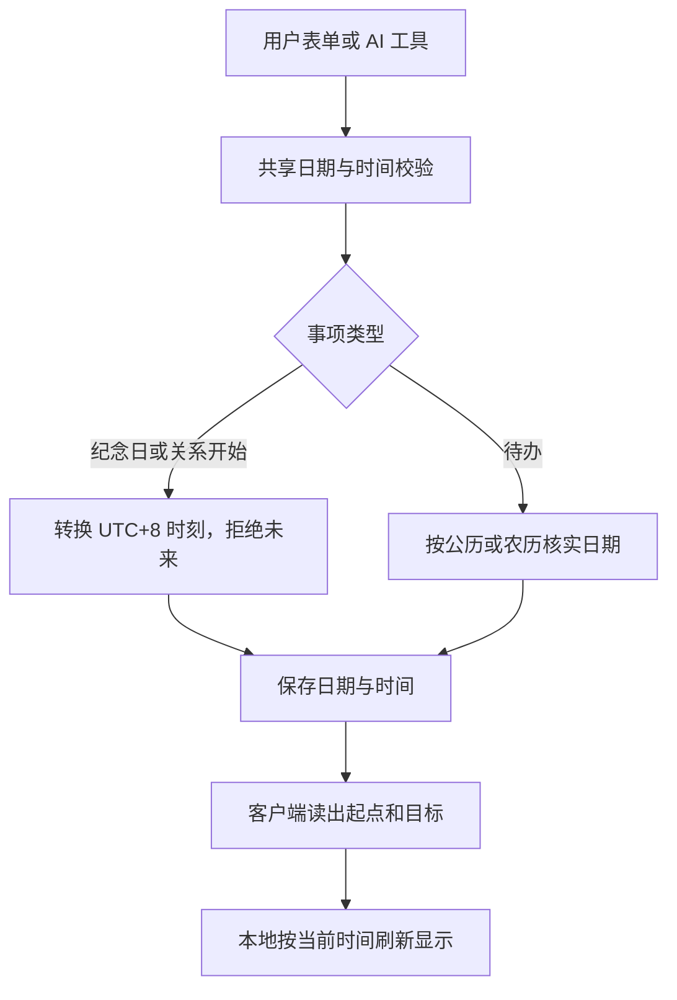
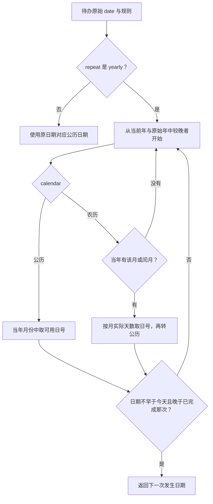
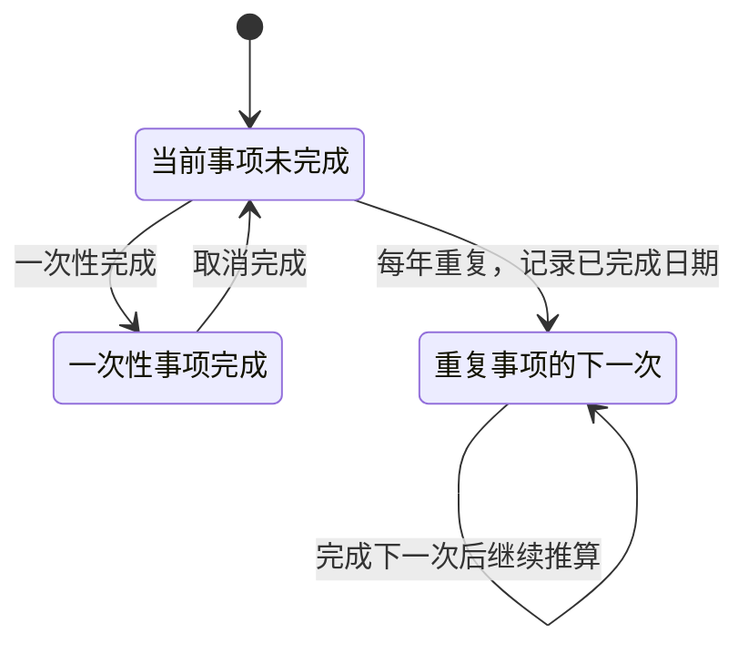

# 日程与日期：同一条规则怎样用于网页、服务端和 AI

日期规则集中在 packages/calendar，前端显示、服务端校验和 AI 工具共用它。这样不会出现网页说某个农历日期不存在，AI 却成功写入的两套规则。

代码入口：[calendar/index.js](../../../packages/calendar/index.js)、[schedules.ts](../../../apps/server/src/schedules.ts)、[AI 业务工具](../../../apps/server/src/ai.ts)。

## 存储的是日期与时间，不是每秒更新的数字

关系开始时间和纪念日保存公历 date 与 HH:mm:ss。待办另外保存 calendar、leapMonth、repeat 和完成状态。数据库使用 TEXT / 整数表达，不依赖数据库服务器的本地时区。

显示“已经在一起多少秒”由客户端计算，不是后端每秒写库或每秒发请求。UTC+8 是应用日期解释约定，与服务器系统时区、手机时区可以不同。默认时间是 00:00:00；省略时间不表示当前上传时刻。

## 一次性待办和每年重复怎么找下一次

图中的回到 D 表示继续下一年，不是重新查同一年。代码遍历到支持上限 2100 年；找不到就返回 null。日期范围为 1900～2100 年，不能无限向未来推算。

公历 2 月 29 日在非闰年取 2 月 28 日。农历三十在只有 29 天的月份取最后一天。闰月没有对应月份的年份直接跳过，不擅自把闰月活动改成普通月。

## 完成状态为什么有 completedDate

completed 是完成标记，completedDate 保存已完成的发生日期。重复事项的下一次计算会排除它，避免用户点完成后仍显示同一年的活动。不要每次完成都覆写原始 date；原始规则决定今后的月份、日号和时间。

这些规则计算的是日程，不是操作系统闹钟服务。Android 的聊天通知来自消息 SSE；它不会因为数据库里有一条待办就自动注册一个定时闹钟。

## 修改日期规则时需要一起看什么

检查表单、后端 Schema、AI 参数、calendar 测试和旧日程的解释。如果只是修正显示或计算，不一定改变 SQL 结构；如果新增持久化字段，按[数据库迁移](../migrations.md)增加增量。测试需要覆盖跨年、闰年、农历小月、闰月、北京时间日界和完成后的下一次。
