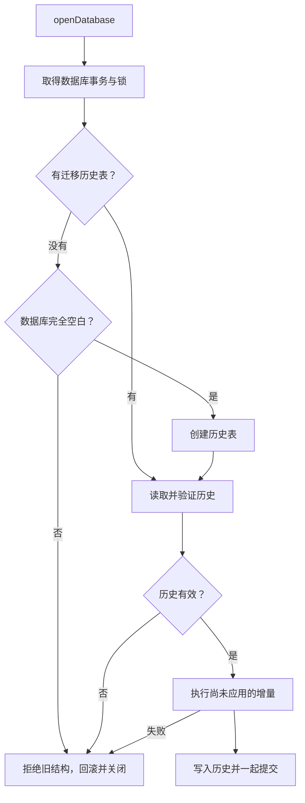
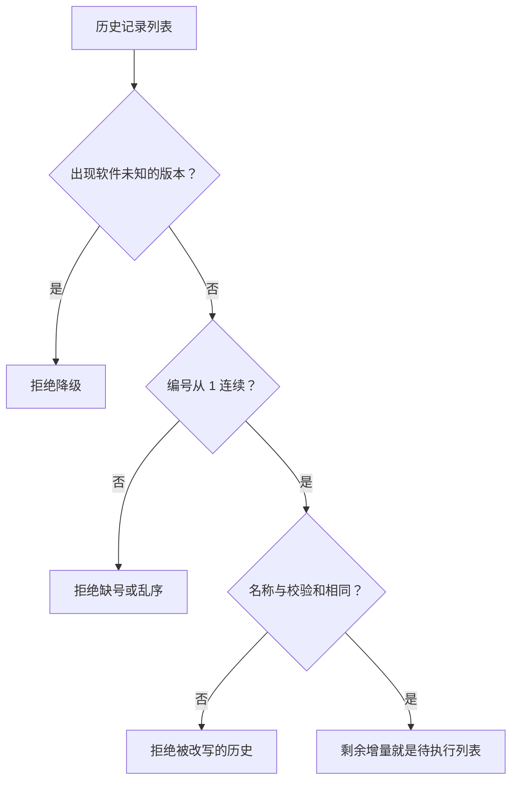
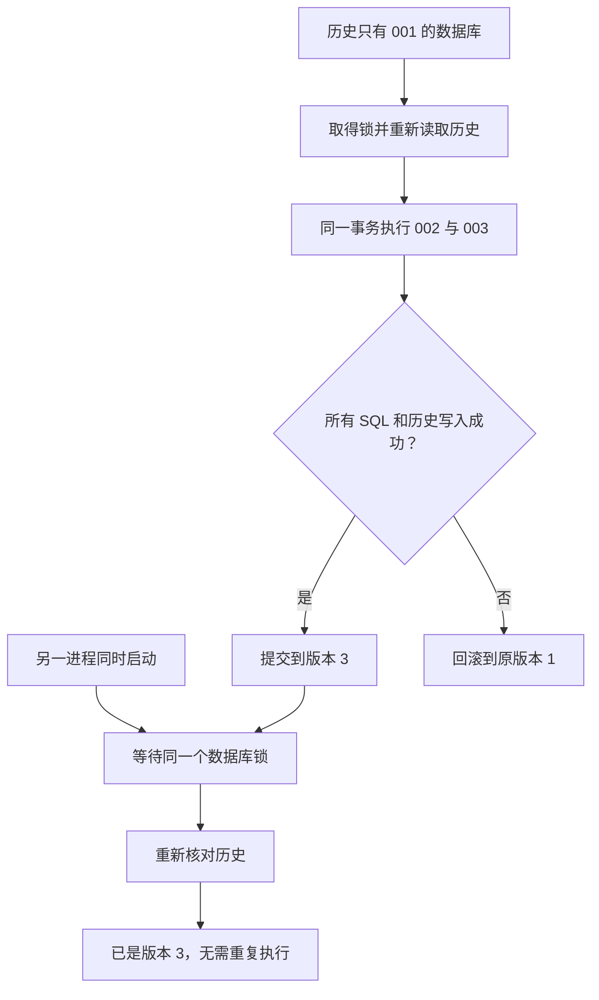

# 表结构更新后：数据库怎样迁移

这里的 schema 指表、列、索引和约束的定义，不是 PostgreSQL 中 public 那个命名空间。数据库迁移就是把已有定义和数据升级到新定义，同时留下可以核实的执行记录。

代码入口：[migrations.ts](../../../apps/server/src/migrations.ts)、[迁移 001](../../../apps/server/src/migrations/001-initial.ts)、[openDatabase](../../../apps/server/src/db.ts)。新增代码的规范和示例见[迁移规范](../migrations.md)。

## 当前版本 1 是什么

001 固定当前两种数据库的初始结构；注册表只有这一项，因此 SCHEMA_VERSION=1。空数据库先创建 schema_migrations，再执行 001。旧体系的 schema 4～9 和没有新迁移历史的已有业务库拒绝导入，不按“数字更大”算成当前体系。

SQLite 除检查表外，还拒绝没有历史但带旧 user_version 标记的数据库。只有历史表却历史为空、同时已有其他表，也会拒绝，防止误把已有库当空库初始化。

## 比较的不只是最大编号

schema_migrations 保存 version、name、checksum、applied_at。checksum 是编号、名称、两种数据库 SQL 的 SHA-256。历史必须从 1 开始且是当前定义的连续前缀。

因此不能修改已经发布的 001，也不能删除历史记录后重新打版本号。看起来同名的表不等于同一段迁移历史；校验和把这个区别固定下来。

## 假设未来增加一个字段

假设版本 2 要给 couples 加 label，版本 3 要建立新索引。开发者追加 002 和 003，分别提供 SQLite / PostgreSQL SQL，不把新字段倒写进 001。

图中的 002、003 是假设例子，当前没有这些增量。实现将一次启动的全部待执行迁移放在同一事务里；不是每个增量单独提交。第二个进程必须锁内重新检查，不能使用等待前看到的旧历史来重复迁移。

已有行需要新值时，增量同时负责回填。两种数据库的语法可以不同，但升级后的业务含义必须一致。不能使用需要脱离事务的 DDL，也不能在 SQL 增量里做模型调用等外部副作用。

## 备份里的数据库如何参与同一链

恢复先核实旧快照的格式、摘要和原有迁移历史，之后对临时 love.sqlite 调用 openDatabase。因此恢复不是另一套手写的“最新版建表脚本”，它使用同一个 SQL 注册表。

格式升级只改变文件表达；SQL 升级才改变表。若一份备份的格式和表都落后，先把它变成当前格式的有效数据包，再执行 SQL 增量，最后恢复。数据库升级不会修改源 tar.gz。

新表还要加入 transferTables；旧表相对顺序和旧摘要读法要稳定。字段手册、备份历史测试和两种数据库测试应随增量一起更新，否则“服务端能启动”不代表“旧备份能恢复”。

备份增量转换器与 SQL 增量共同保存在 `apps/server/src/migrations/`，备份文件位于其 `backup/` 子目录。两条链的编号、注册与添加步骤见[备份迁移开发约定](../backup-migrations.md#增量文件与-sql-放在哪里)。
