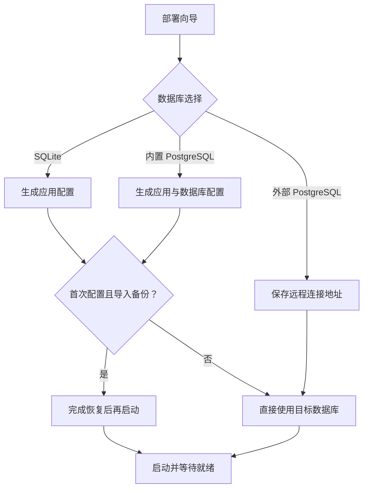
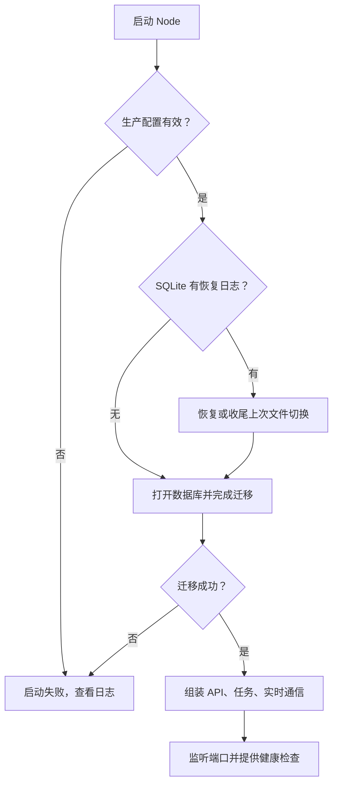
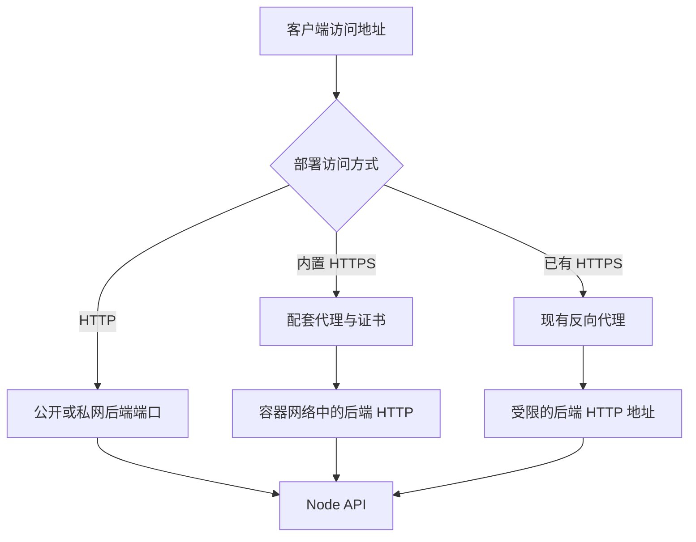

# 启动与部署：配置怎样变成运行中的服务

Love 有两个不同进程：宿主机上的 love 管理程序，以及容器里的 Node 后端。前者生成配置并运行 Docker Compose，后者打开数据库、处理用户请求。已经编译的管理程序不需要宿主机安装 Node 或 Bun；应用容器仍提供 Node、转码工具等运行环境。

代码入口：[管理程序](../../../manager/manager.mjs)、[部署向导](../../../manager/setup.mjs)、[后端启动](../../../apps/server/src/index.ts)、[应用组装](../../../apps/server/src/app.ts)。

## 首次配置为什么先问数据库

数据库选择影响服务组合、卷和维护方式。SQLite 使用应用卷；内置 PostgreSQL 加数据库容器；外部 PostgreSQL 直接连接现有数据库。外部连接不会自动把本地数据覆盖过去。

是否首次配置按 love 同级目录是否已有 .env 判断。非外部数据库才在首次配置询问导入；外部数据库既有数据走正常打开与迁移。配置文件和 Compose 模板由 love 在自己的目录旁创建，跟你运行命令时的临时目录无关。

## 后端什么时候开始接受请求

生产环境先检查媒体密钥和管理员环境变量。SQLite 若存在上次未完成的恢复日志，先处理文件恢复；随后 openDatabase 完成 SQL 迁移，createApp 才建立路由、管理员同步、媒体目录和任务处理。最后启动 HTTP 服务。

“容器进程启动了”和“应用健康了”是两件事。迁移、数据库连接和初始化失败会阻止正常服务，管理程序通过就绪检查判断结果。没有一个忽略迁移错误继续运行的分支。

## 为什么修改 .env 后 restart 不够

.env 是 Compose 创建容器时的输入。容器环境不会在应用里实时跟踪宿主机文件。修改部署配置要重新应用、创建相应容器；restart 只重启已有容器。后台业务设置则在数据库里，保存后应用读取新值。

| 配置                                 | 保存位置           | 生效边界         |
| ------------------------------------ | ------------------ | ---------------- |
| 数据库地址、监听、代理、管理员和密钥 | 部署 .env          | 重新应用容器配置 |
| 注册、邮件、额度、日志保留           | server_config 等表 | 后台保存后       |
| AI 与原文件保留                      | 当前配对的设置表   | 请求读取当前配置 |
| 服务器地址、主题与通知选择           | 客户端偏好         | 当前设备         |

## HTTPS 和访问地址属于哪一层

后端提供 HTTP；证书是可选部署代理的职责。服务器绑定 0.0.0.0 是监听规则，不是手机填写的地址。手机填实际 IP 或域名。数据库连接地址又是后端到数据库的一条独立网络路径，网页能打开不代表数据库能连接。

TRUST_PROXY 让后端按可信代理的转发头识别来源，只能用于后端端口受限的代理部署。详细变量见[配置参考](../configuration.md)，手工代理配置见[部署参考](../deployment.md)。
