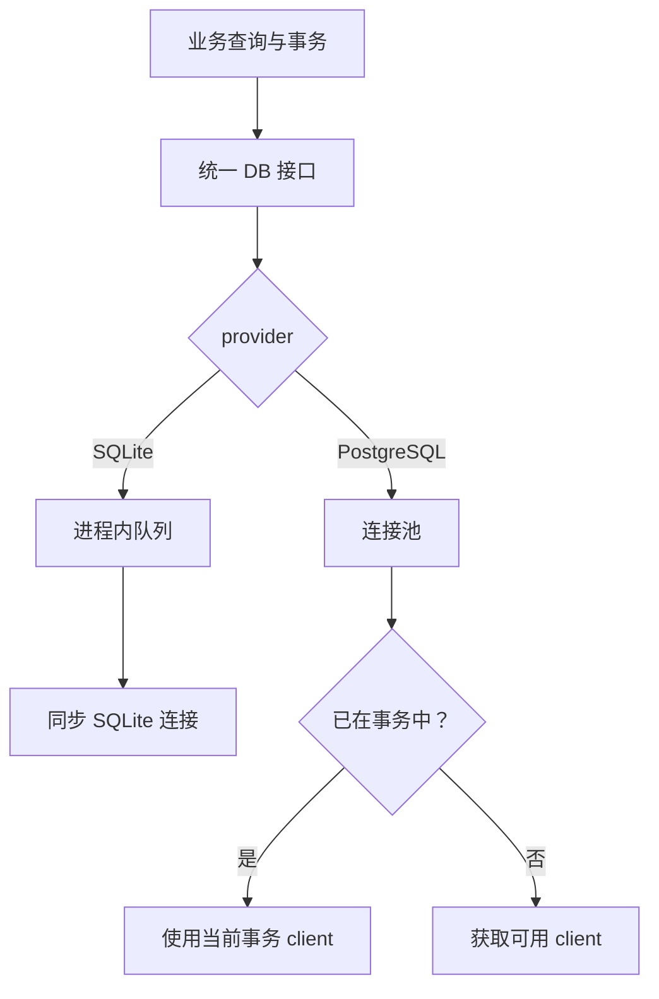
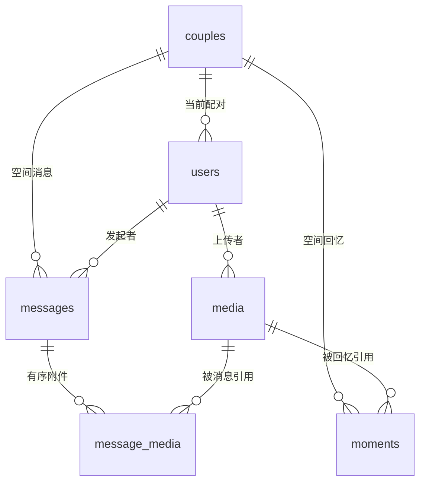
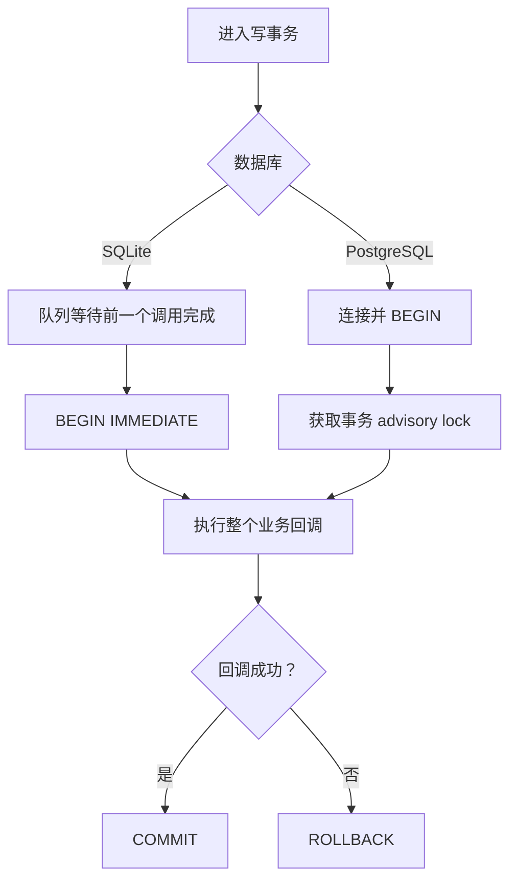
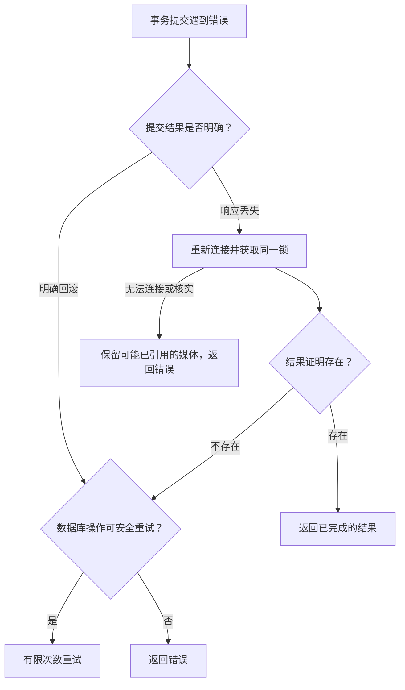

# 数据库与事务：一组改动怎样一起成功

事务可以理解为“把一组修改打成一个包”：全部完成就提交，任一步失败就回滚。例如发送附件消息时，媒体发布、容量和消息记录必须一起成功，否则会出现收了容量却没有消息，或消息引用不存在的文件。

代码入口：[db.ts](../../../apps/server/src/db.ts)、[postgres.ts](../../../apps/server/src/postgres.ts)、[media-storage.ts](../../../apps/server/src/media-storage.ts)。字段手册见 [SQLite](../database-sqlite.md) 和 [PostgreSQL](../database-postgresql.md)。

## 统一接口不等于相同的底层行为

业务代码调用异步 DB.prepare、exec、transaction。SQLite 的底层 API 是同步的，外面加队列；PostgreSQL 使用连接池。SQL 中的问号参数由适配层转为 $1、$2，并处理驼峰字段引用，参数值不会作为 SQL 拼进去。

AsyncLocalStorage 保存当前异步调用链的事务上下文。事务里的 helper 再调用 transaction，会加入同一个事务，不另外提交，也没有独立 savepoint。修改 helper 时不能假设它拥有自己的可回滚子事务。

## 关键表怎样关联

图展示主要关联方向，不枚举全部外键。两人限制由业务事务检查，users.coupleId 的 SQL 外键本身并不限制最多两人。个人头像的 media.coupleId 可空，解配对后 users 不再关联原空间，但消息和回忆仍属于原 couple。字段、NULL 与全部约束以两份表结构手册为准。

## 两种数据库怎样串行写入

SQLite 的队列避免同一连接的并发异步请求混进别人事务；BEGIN IMMEDIATE 取得数据库写锁。PostgreSQL 的固定 advisory lock 将应用写事务串行化；它只约束同样遵守锁约定的调用方，手工 SQL 不会自动遵守。

PostgreSQL 的备份快照使用 REPEATABLE READ READ ONLY，固定读取视图，不走普通写事务锁。连接池不意味着当前业务设计允许无限并发写入；也不意味着多后端实例自动共享 Socket 房间。

## 连接断了为什么不能总是重试

读请求或业务回调尚未开始时，临时网络错误可以安全重试。进入业务回调后，它可能已经写文件或调用外部服务，所以通用事务层不会盲目重放整个回调。

最棘手的是 COMMIT 已发出，但响应丢失：数据库可能提交了，也可能没有。媒体层为这类操作提供额外的结果证明，比如预先分配的媒体 ID 或恢复操作 ID。

不能因“HTTP 请求失败”就认定“数据库没提交”。如果不确定时删除媒体，可能把已经成功的消息或相册弄坏。commitMedia 只重试约定为数据库修改的回调，文件在进入它之前已持久化。

认证错误、SQL 语法错误、唯一约束错误不会被当成临时网络问题。重试次数与超时可以配置，但加大数值不能修复错误地址、错误密码或不可达网络。

## 修改代码时怎么守住事务边界

先预分配可用于去重的 ID，再准备和同步文件，最后在同一事务里核实身份、容量并写关联。事务成功后发 Socket 事件。文件系统和数据库不是一个跨系统事务，所以必须明确失败时哪些文件可以删除、哪些要留给后续核实或清理。

SQL 层的约束只覆盖手册列出的部分，日期、枚举和归属还由业务校验。写新查询时，即使 ID 看起来唯一，也要带当前配对或用户条件。
